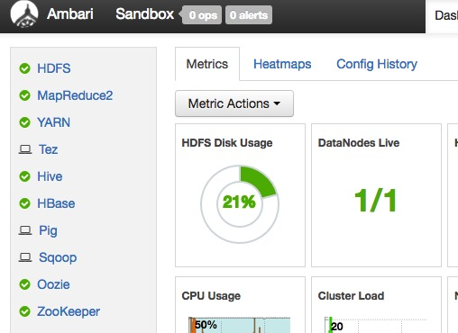
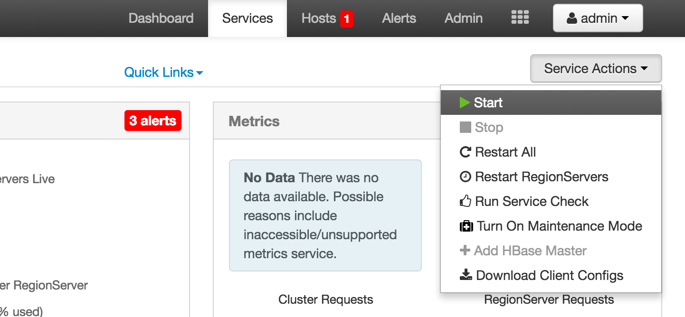

## KAP Quick Start on HDP sandbox

KAP releases a few sample data sets and cubes in its package together. User could import the data set and cube easily by executing the sample script. For more detail information about installation and usage instruments, please refer to other related guide documents. 

### Prepare Environment

KAP need run in a Hadoop node, to get better stability, we suggest you to deploy it a pure Hadoop client machine, on which its command like *hive*, *hbase*, *hadoop*, *hdfs* already be installed and configured. To make things easier we strongly recommend you try KAP with *All-in-one* sandbox VM, like *Hortonworks Sandbox (HDP)* and *Cloudera QuickStart VM (CDH)*. The minimal memory should be 10GB. 

> Since different Sandbox have different HBase version, please install the corresponding KAP distribution.
>
> Please use *HBase 0.98* distribution on *HDP 2.2*; Please use HBase 1.x distribution on *HDP 2.3+* 
>
> Please use CDH distribution on *CDH 5.7+*

To avoid permission issue in the sandbox, you can use its *root* account through SSH . The password for *Hortonworks Sandbox 2.2* is *hadoop*, password for *Horonworks Sandbox 2.3+*, please refer to the [Hortonworks Documents]((http://zh.hortonworks.com/hadoop-tutorial/learning-the-ropes-of-the-hortonworks-sandbox/)). 

This guide uses *root* as example. 

We also suggest you using *bridged* mode instead of NAT mode in Virtual Box settings. Bridged mode will assign your sandbox an independent IP address so that you could access the KAP web page locally and remotely. 

Make sure the following services running in normal state, (login Ambari Portal  [http://{hostname}:8080](http://{hostname}:8080) ,default username *admin*, password *admin*) HDFS/MapReduce2/YARN/Hive/HBase/ZooKeeper, without warning information. The *Service Check* in Ambari is recommended, especially HBase service.



The following parameters should be updated, to meet the KAP resource requirement.

1. For *HDP 2.2*, update *yarn.nodemanager.resource.memory-mb* to *8192*, *yarn.scheduler.maximum-allocation-mb* to 4096; for *HDP 2.3/2.4*, update YARN-Configs->Settings->Memory Node to *8192*
2. For *HDP 2.3+*, update MapReduce2-Configs->Advanced->*MR Map Java Heap Size* and *MR Reduce Java Heap Size* to *-Xmx3072*
3. If meet *org.apache.hadoop.hbase.security.AccessDeniedException: Insufficient permissions for user 'root (auth:SIMPLE)'*, that means no enough HBase write permission. If you want to disable HBase permission check, please update *hbase.coprocessor.region.classes* and *hbase.coprocessor.master.classes* to empty, and *hbase.security.authentication* to *simple*.


### Start Hadoop

use ambari to launch hadoop

```shell
ambari-agent start
ambari-server start
```

With both command successfully run you can go to ambari homepage at [http://{hostname}:8080](http://your_sandbox_ip:8080/) (username:admin,password:admin)to check everything’s status. 

By default hortonworks ambari disables Hbase, you need manually start the Hbase service at ambari homepage.

   

### Install KAP

To obtain KAP package, please refer to [KAP release notes](../release/README.md). There may some minor differences between KAP and KAP plus. 

Copy KAP binary package into the server mentioned above, and decompress to /usr/local

```shell
cd /usr/local
tar -zxvf kap-{version}-{hbase}.tar.gz 
```

Set environment variable `KYLIN_HOME` to KAP home directory.

```shell
export KYLIN_HOME=/usr/local/kap-{version}-{hbase}
```

Create KAP working directory on HDFS, and grant privileges to KAP, with read/write permission.

```shell
hdfs dfs -mkdir /kylin
hdfs dfs -mkdir /user/root
```

> If no write permission on HDFS, please switch to hdfs account first, create the directory, and grant the privileges. 

```shell
su hdfs
hdfs dfs -mkdir /kylin
hdfs dfs -chown root /kylin
hdfs dfs -mkdir /user/root
hdfs dfs -chown root /user/root
```

Since the sandbox has limited resource, please shift the current configuration to minimal profile.

```shell
cd $KYLIN_HOME/conf

# Use sandbox(min) profile
ln -sfn profile_min profile
```

### Environment Check

KAP will retrieve Hadoop dependency from environment by reading environment variables. The variables include: HADOOP_CONF_DIR, HIVE_LIB, HIVE_CONF, and HCAT_HOME. The example configuration:

```shell
export HADOOP_CONF_DIR=/etc/hadoop/conf
export HIVE_LIB=/usr/hdp/current/hive-client/lib/
export HIVE_CONF=/etc/hive/conf
export HCAT_HOME=/usr/hdp/current/hive-webhcat/
```

``bin/check-env.sh`` will check if all environment meets the KAP requirements. 

### Start KAP

Execute command `bin/kylin.sh start`, KAP will start in background. You can track starting progress by watching file `logs/kylin.log` with `tail` command.

```shell
${KYLIN_HOME}/bin/kylin.sh start
```

To confirm KAP is running, check the process by `ps -ef | grep kylin`.

> If hit problem, please confirm all KAP processes are stopped before restart. See "Stop KAP" section for details.

### Open KAP GUI

After starting KAP, open browser and visit KAP website `http://<host_name>:7070/kylin`. KAP login page shows if everything is good.

Please replace `host_name` to machine name, ip address or domain name. The default KAP website port is 7070.

Once login to KAP successfully, you can validate the installation by building a sample cube. Please continue to [Install Validation](install_validate.en.md).

### Stop KAP
Execute command `bin/kylin.sh stop` to stop KAP service.

Confirm KAP process is stopped, `ps -ef | grep kylin` should return nothing.
