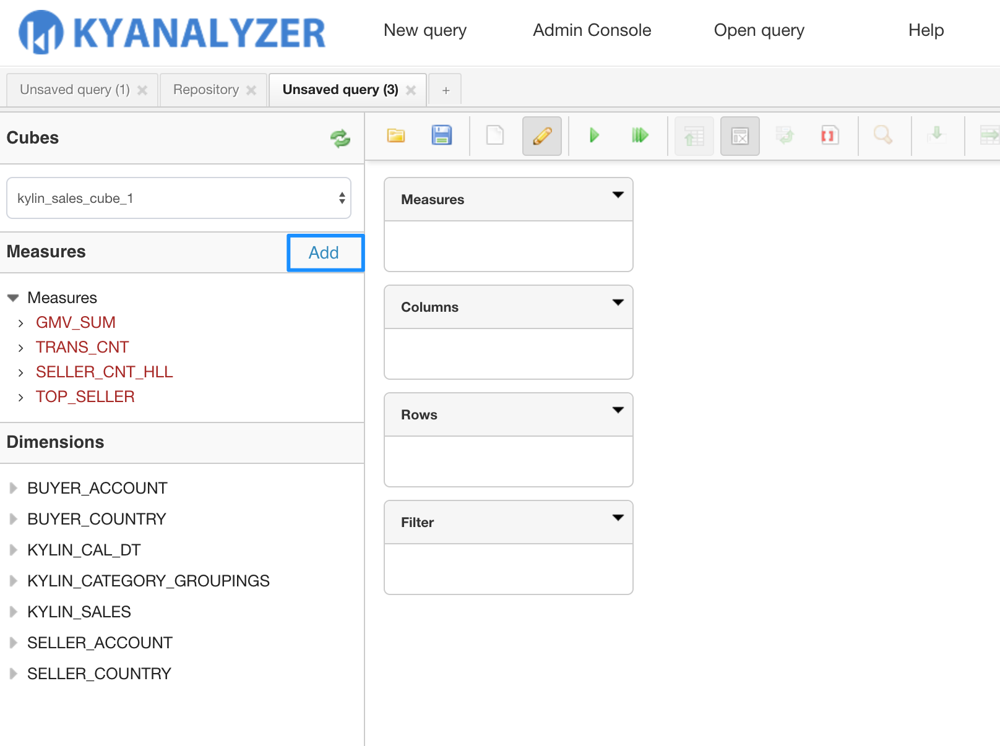
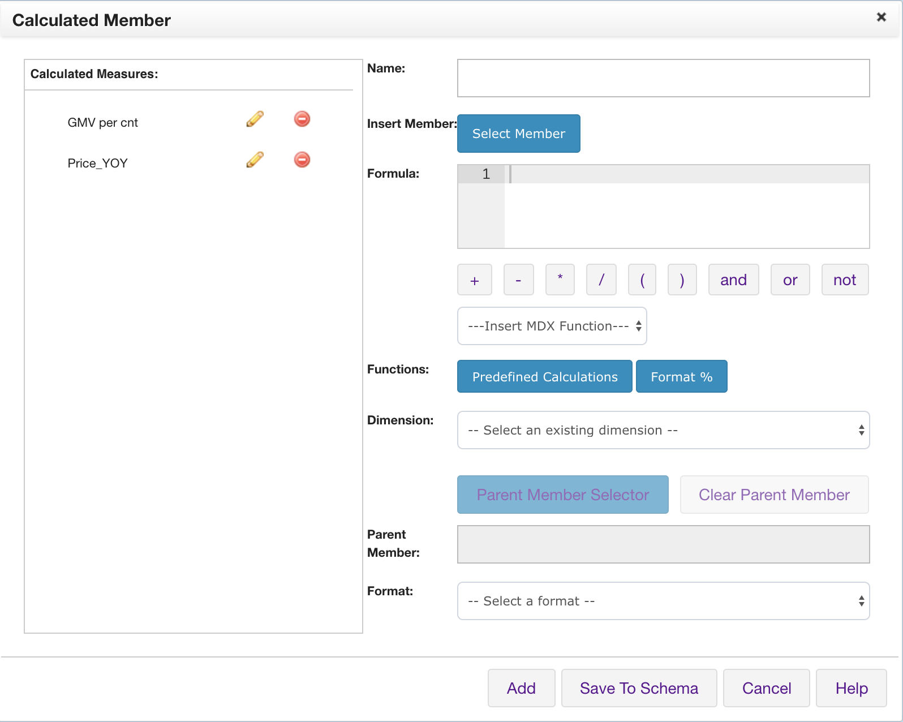
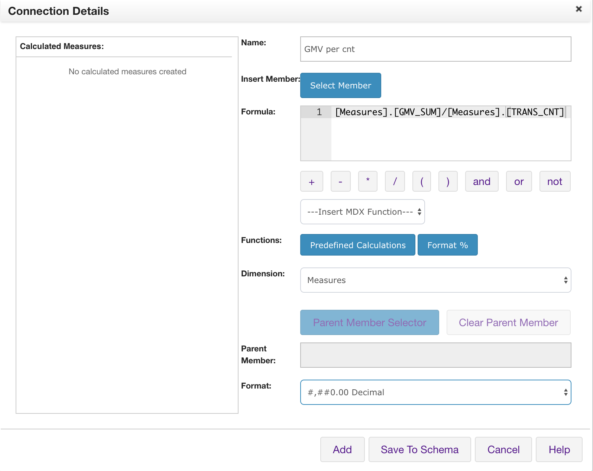

### Calculated Member

Calculated Members are members of a dimension or a measure group that are defined based on a combination of cube data, arithmetic operators, numbers, and functions. For example, you can create a Calculated Member that calculates the sum of two physical measures in the cube. Calculated member definitions are stored in KyAnalyzer, but their values are calculated at query time.

KyAnalyzer can support creating calculated member using MDX. 

Use KAP sample cube for example let's use measure `GMV_CNT` and `TRNS_CNT` to create a new Calculated member.

1. Click `Add` on the right side of member panel.



1. You can start edit calculated member in this pop-up window. 

   The calculated member once created will be displayed on the left side window for users to modify or delete.



1. Click `Select Member` to choose `GMV_CNT` and `TRNS_CNT` .


define formula as 

```sql
[Measures].[GMV_SUM]/[Measures].[TRANS_CNT]
```

For `Dimension` choose Measures. 

You may select display format for the calculated member in `Format` drop-down menu.

When you are done editing calculated member, you may either click `Add` or `Save to Schema` to save this calculated member. `Add` will add this calculated member only to your current query. `Save to Schema` will save this calculated member to the schema of current Cube and can be reused by other users who create queries from this Cube.



1. a saved calculated member will show up on the `Measures` of current query. Now you may use it as a normal measure on the report.


