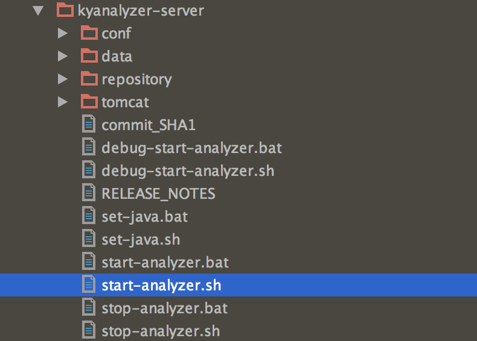
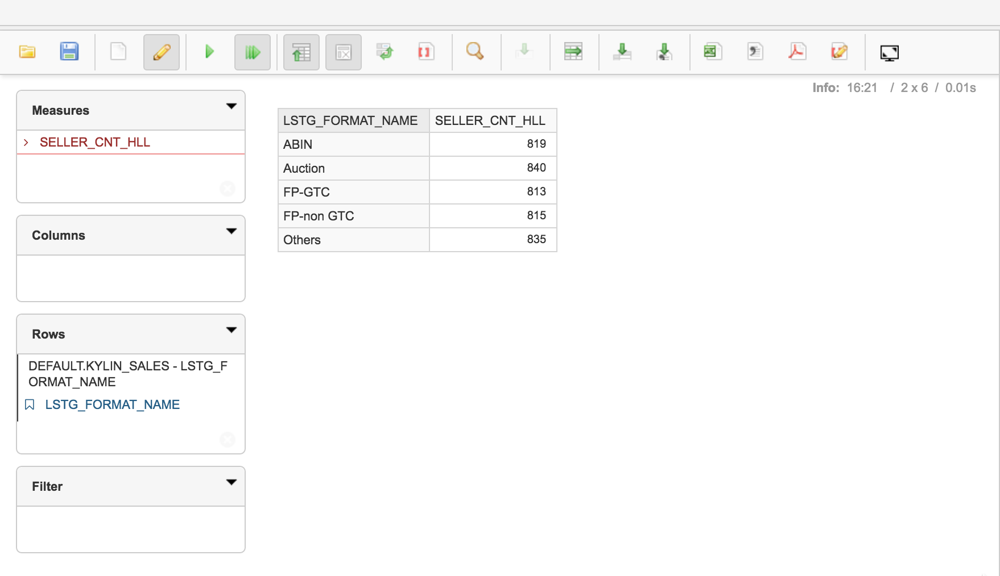
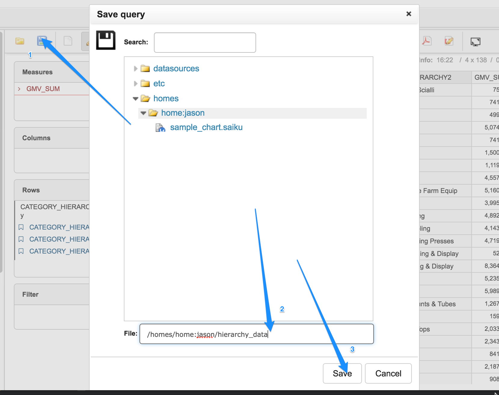
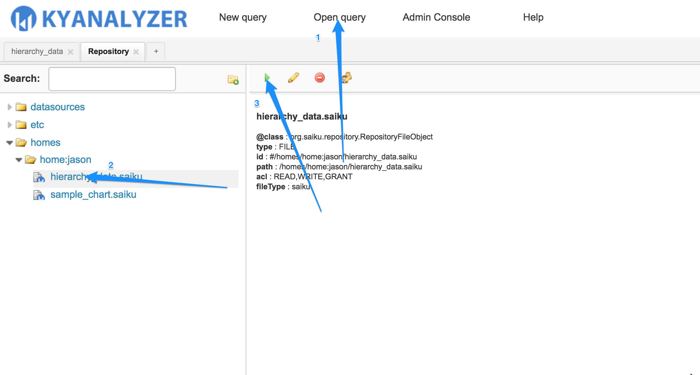
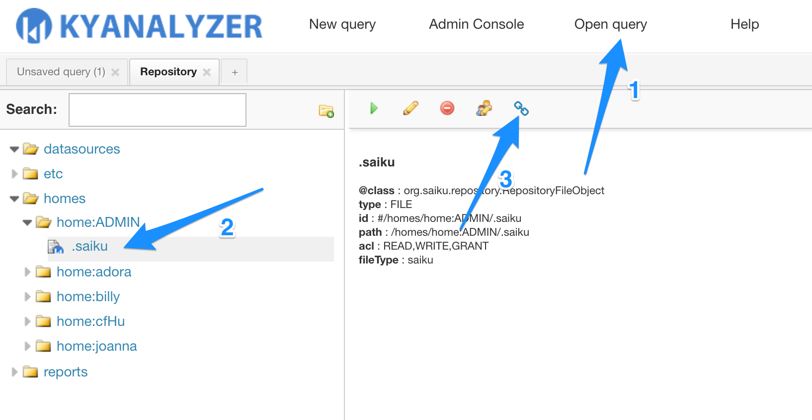
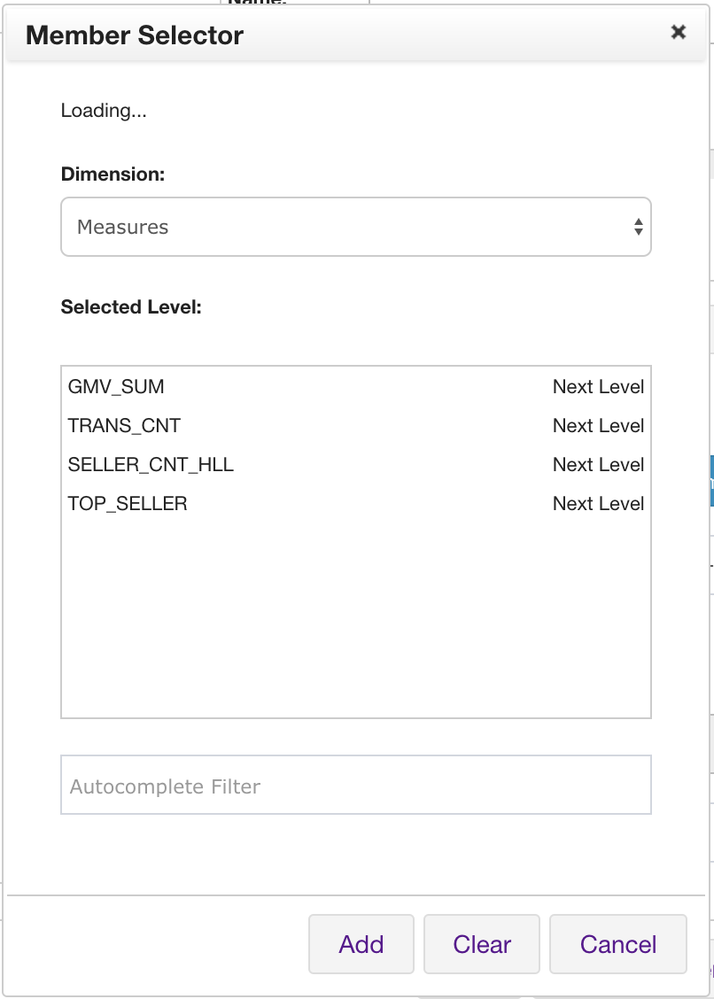
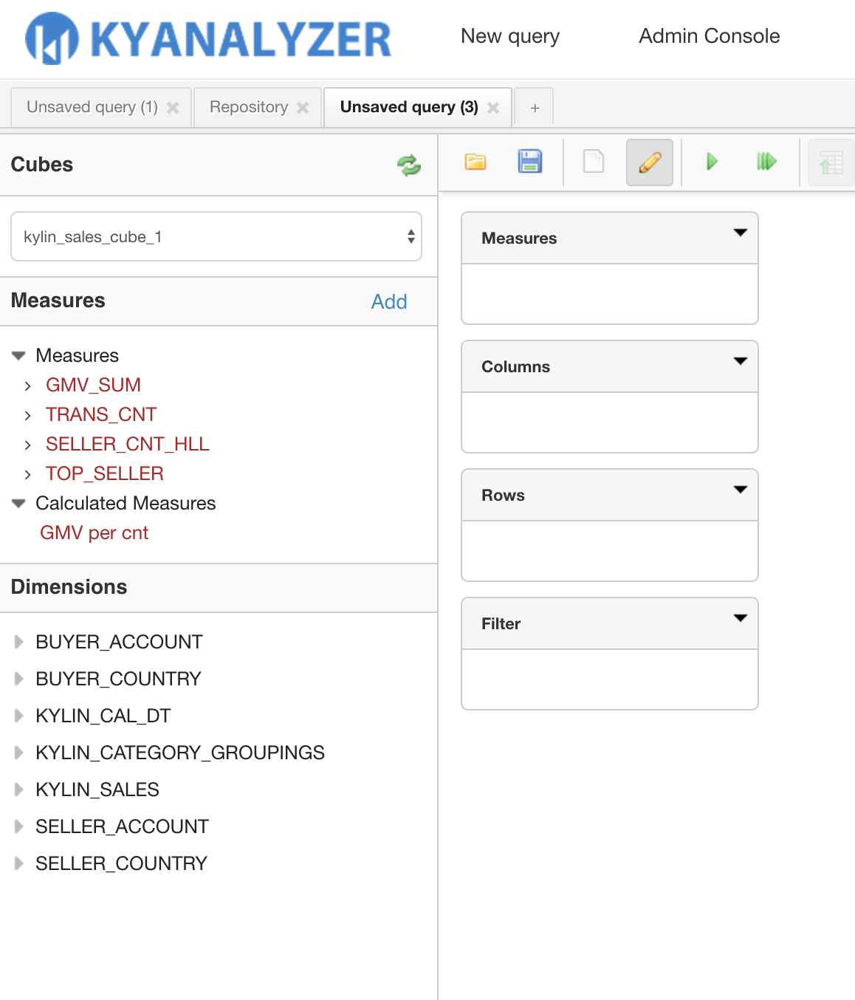

## KyAnalyzer Self-service Agile BI Tools

KyAnalyzer allow user analyze data easier and quicker.


###Pre-Condition
* KAP should be version 2.1 or later
* Apache Kylin version should be 1.5.4.1 or later.
* KyAnalyzer does not supprt *left join*, you should use *inner join* when create cube mode in KAP.

### Installation
Go to [ KyAccount ]( http://account.kyligence.io/ ) to apply for KyAnalyzer's Installation package and license, Unzip kyanalyzer's install package, it will then generate folder kyanalyzer-server-{version}:

```tar-zxf KyAnalyzer-{version}.tar.gz```

Copy license file kyAnalyzer.lic to kyanalyzer-{version}/conf.

```mv kyAnalyzer.lic kyanalyzer-{version}/conf```

Edit kyanalyzer.properties under kyanalyzer-server-{version}/conf，set KAP host and KAP port, *kap.host* represents KAP IP(default value localhost), and *kap.port* represents KAP app port (default port is 7070). And you can edit mondrian.properties refer to conf/mondrian.properties.template.（Note: we have moved 'kap.host' and 'kap.port' to kyanalyzer.properties since kap2.2, and also add mondrian.properties to kyanalyzer-server/conf/）

Run below script under kyanalyzer-{version} folder to start KyAnalyzer, the default port is 8080. 

```sh start-analyzer.sh```

When the server is started, please visit http://{hostname}:8080. If you want to stop the server, please run under kyanalyzer-{version} folder 

```sh stop-analyzer.sh```

If the server is not started normally, please check the logs under tomcat/logs for details. Make sure there's no port conflict, you can check it in tomcat/logs/catalina.out. To fix port conflict, find config item below:
```$xslt
<Connector port="8080" protocol="HTTP/1.1"
               connectionTimeout="20000"
               redirectPort="8443" />
```
And modify port to a un-used one.

#### Files under home directory



### Upgrade
KyAnalyzer will save data under the directory *repository* and *data*, suppose you are upgrading KyAnalyzer from KyAnalyzer-1 to KyAnalyzer-2, steps for upgrading are below:

* Back up KyAnalyzer-1's data

  + Under KyAnalyzer-1's install folder, make a backup folder, run `mkdir backup`
  + Run command `cp -r data repository ./backup/` to backup data to folder "backup"

* Restore KyAnalyzer-2's data to KyAnalyzer-1's

  + Install new KyAnalyzer as KyAnalyzer-2, suppose KyAnalyzer-2 and KyAnalyzer-1's folders are {KyAnalyzer-2} and {KyAnalyzer-1}
  + Under KyAnalyzer-2's folder, delete KyAnalyzer-2's data folders first with command `rm -rf data repository`
  + Under KyAnalyzer-2's folder, run`cp -r ${KyAnalyzer-1}/backup/* ./`
  
* Notice the default port is set 8080, which means that you can visit http://{hostname}:8080 to get KyAnalyzer login page. If you need to change this port, please config the tomcat/conf/server.xml file or copy and replace the config file of KyAnalyzer-1 to here.

###About KyAnalyzer,KAP,Mondrian-Kylin Version/Features
<table>
    <tr>
    <th>KAP</th>
    <th>KyAnalyzer</th>
    <th>Mondrian-Kylin</th>
    <th>COUNT_DISTINCT</th>
    <th>TOP_N</th>
    <th>Normal Query</th>
    <th></th>
    </tr>
    <tr>
        <td>2.0</td>
        <td>2.1</td>
        <td>1.0</td>
        <td>❎</td>
        <td>❎</td>
        <td>✅</td>
        <td></td>
    </tr>
    <tr>
        <td>2.0</td>
        <td>2.1</td>
        <td>1.1</td>
        <td>✅</td>
        <td>❎</td>
        <td>❎</td>
        <td></td>
    </tr>
    <tr>
        <td>2.1</td>
        <td>2.1</td>
        <td>1.0</td>
        <td>❎</td>
        <td>❎</td>
        <td>✅</td>
        <td></td>
    </tr> 
    <tr>
        <td>2.1</td>
        <td>2.1</td>
        <td>1.1</td>
        <td>✅</td>
        <td>✅</td>
        <td>✅</td>
        <td>Recommended</td>
    </tr>     
</table>


###About KyAnalyzer,Apache Kylin,Mondrian-Kylin Version/Features
<table>
    <tr>
    <th>Apache Kylin</th>
    <th>KyAnalyzer</th>
    <th>Mondrian-Kylin</th>
    <th>COUNT_DISTINCT</th>
    <th>TOP_N</th>
    <th>Normal Query</th>
    <th></th>
    </tr>
    <tr>
        <td>ALL</td>
        <td>2.1</td>
        <td>1.0</td>
        <td>❎</td>
        <td>❎</td>
        <td>✅</td>
        <td></td>
    </tr>
    <tr>
        <td>version earlier than1.5.4.1</td>
        <td>2.1</td>
        <td>1.1</td>
        <td>✅</td>
        <td>❎</td>
        <td>❎</td>
        <td></td>
    </tr>
    <tr>
        <td>1.5.4.1</td>
        <td>2.1</td>
        <td>1.1</td>
        <td>✅</td>
        <td>❎</td>
        <td>✅</td>
        <td></td>
    </tr> 
    <tr>
        <td>version later 1.5.4.1</td>
        <td>2.1</td>
        <td>1.1</td>
        <td>✅</td>
        <td>✅</td>
        <td>✅</td>
        <td>Recommended</td>
    </tr>         
</table>


### Authentication
KyAnalyzer authenticates user at KAP side, so you can use KAP user and password to login. Users with *Admin* Role in KAP are also *Admin* in KyAnalyzer.


### Admin Page
Only the admin could visit this page.
To import the Cube from KAP, KyAnalyzer needs to create schema and datasource for each cube in KAP by default. KyAnalyzer automatize the flow, user don't have to write schema by themeselves.
Click `Sync Cubes From Kylin` on the left side, the right panel will list all projects from KAP.


Click the green button `Sync Cubes From Kylin` after select project, KyAnalyzer will create *schema* and *datasource* for all cubes under this project whose status is 'READY'.


The schema could be edited online in KyAnalyzer, it's not necessary at most time.

### User's query authority to cubes
User's query authority to cubes in KyAnalyzer is consistent with kylin/kap's, for details, please refer to [Manage Permissions](../security/acl.en.md).

### New Query
Click `New Query` button at navigation bar, then click `Refresh` button to fetch the latest meta data, select the cube under *Cubes* menu, now all dimensions and measures are shown. In the report designer area, here are four panels: *Measures*, *Columns*, *Rows*, *Filter*. User could drag measures into Measures panel, and dimensions into Columns and Rows panels.


KyAnalyzer supports many types of visulization, table, bar, stacked bar, line chart, area chart, heat grid, tree map, pie chart, dot chart, water fall chart ,etc.

#### Bar


#### Pie


#### Pivotal Table


#### COUNT DISTINCT


#### Hierarchy Data


### Result Filter
To filter the results, you can click the dimension name and see the filter dialog, input the search pattern to filter the select options, and select your options, you can include or exclude the options.


### Save Query Result
You can export results to files(csv, pdf, excel) or pictures.

#### Export grid to files


#### Export chart to picture


### Save query results in KyAnalyzer
The query result could be saved in KyAnalyzer, so next time when you login, you don't have to select your dimensions and measures again.

#### Save Query


#### Open Query


#### Execute Query


### Share Query




### Calculated Member

Calculated Members are members of a dimension or a measure group that are defined based on a combination of cube data, arithmetic operators, numbers, and functions. For example, you can create a Calculated Member that calculates the sum of two physical measures in the cube. Calculated member definitions are stored in KyAnalyzer, but their values are calculated at query time.

KyAnalyzer can support creating calculated member using MDX. 

Use KAP sample cube for example let's use measure `GMV_CNT` and `TRNS_CNT` to create a new Calculated member.

1. Click `Add` on the right side of member panel.


2. You can start edit calculated member on this pop-up window. 

   The calculated member once created will be displayed on the left side window for user to modify or delete.


3. Click `Select Member` to choose `GMV_CNT` and `TRNS_CNT` .



define formula as 

```sql
[Measures].[GMV_SUM]/[Measures].[TRANS_CNT]
```

For `Dimension` choose Measures. 

You may select display format for the calculated member in `Format` drop down menu.

When you are done editing calculated member, you may either click `Add` or `Save to Schema` to save this calculated member. `Add` will add this calculated member only to your current query. `Save to Schema`  will save this calculated member to the schema of current Cube and can be reused by other user who create query from this Cube.


4. a saved calculated member will show up on the `Measures` of current query. Now you may use it as a normal measure on the report.




