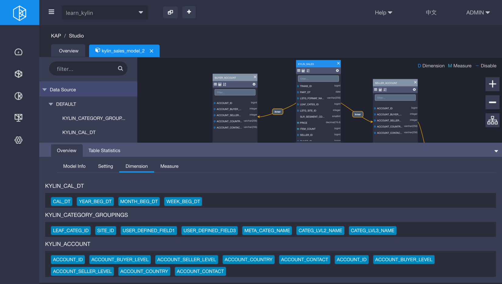
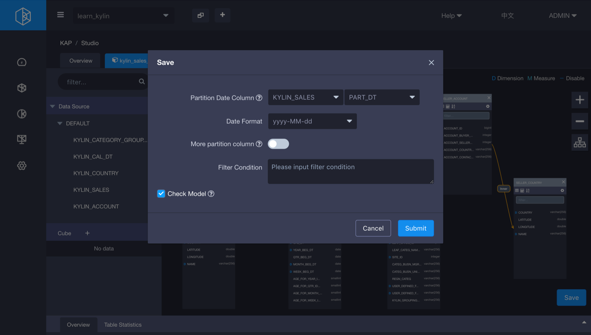

# Create Data Model

Data model is created based on data source. Take the data set coming with KAP as example, there are 1 fact table and 2 lookup tables in it, connected by foreign keys. In fact not all columns on the tables are required for analysis, so we only put the required ones into data model. Then analysts set these columns as dimensions or measures according to specific scenarios.

## Data Model Create Steps

Open KAP Web UI, select project `KAP_Sample_1` in project list located at upper left corner. Then create a new data model on `Model` page.Step 1: Enter data model name `Sample_Model_1` on info page, then click `Next`.Step 2: Select fact table (`KYLIN_SALES`) and lookup table (`KYLIN_CAL_DT`, `KYLIN_CATEGORY_GROUPINGS`) for data model according star schema. Set table connect conditions:KYLIN\_CAL\_DT* Connect Type：Inner* Connect Condition：DEFAULT.KYLIN\_SALES.PART_DT = DEFAULT.KYLIN\_CAL\_DT.CAL\_DTKYLIN\_CATEGORY_GROUPINGS* Connect Type：Inner* Connect Condition:KYLIN_SALES.LEAF_CATEG_ID=KYLIN\_CATEGORY\_GROUPINGS.LEAF_CATEG_IDAND KYLIN_SALES.LSTG_SITE_ID=KYLIN\_CATEGORY\_GROUPINGS.SITE_ID 

The result is shown in the following figure.Step 3: Select dimension columns from fact and lookup tables added in previous step. Date column is usually selected as filter condition, so it's required. Other columns such as category and seller ID are also selected as dimensions. Step 4: Select measures from fact table according to business requirement. For instance, `PRICE` is used to measure sales price, `ITEM_COUNT` is used to measure sales amount and `SELLER_ID` is used to identify seller. Step 5: Select date partition column. New data comes to Hive through ETL every day in general, based on which Cube is build incrementally. Let's select column `DEFAULT.KYLIN_SALES.PART_DT` as partition column and specify the date format as `yyyy-MM-dd`.Finally click `Save` button, data model is created.