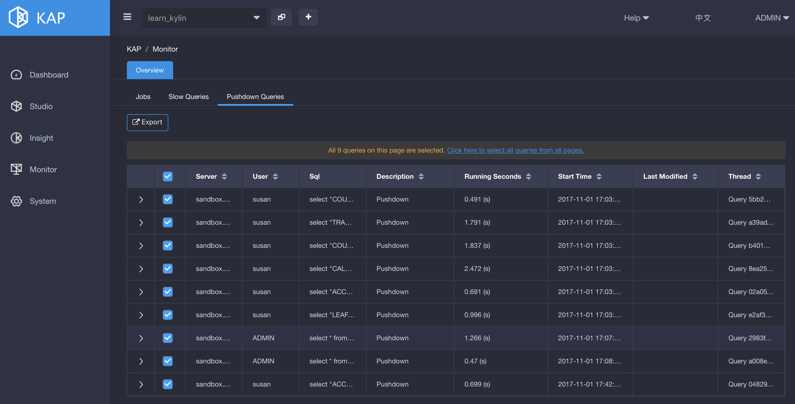

### Query Pushdown

KAP supports query pushdown from KAP 2.4. If there are queries which cannot be fulfilled through customized Cubes, you may simply leverage the query pushdown to redirect the query to Spark SQL, Hive and Impala, making a trade-off  between query latency and query flexibility to obtain a better experience. 

#### Enable Query Pushdown

Query pushdown is turned off by default. To turn it on, remove the Comment symbol in front of the configuration item `kylin.query.pushdown.runner-class-name=io.kyligence.kap.storage.parquet.adhoc.PushDownRunnerSparkImp` in the file `kylin.properties` to bring it into effect. 

With query pushdown turned on, queries that cannot get results from Cubes will be redirected to Spark SQL by default. You may also configure it manually, and choose Hive or Impala as the default engine to be redirected. Please refer to [Important Configurations](../config/basic_settings.en.md) for more configuration settings.

After you turn on the query pushdown, all source tables you have synchronized will be shown without building the corresponding Cubes. When you submit a query, you will find *Pushdown* in the *Query Engine* item below *Status*, if query pushdown works. 

### Basic Actions

The basic actions of the query pushdown are as below:

#### Copy a single query by oneclick

If you want to select a single query, simply click one button, and you will copy the whole information of this query. The actions are as below: click the arrow next to your Server name, the following window will appear. Clicking **Copy** will copy the whole data of this item.

#### Batch export by multi selections

If you want to export in batch, you may click the checkboxs in the first row to select all query results to export; or click the checkboxs in front of the query items based on your requirements, to select multi queries to export.

#### Sorting by clicking

You may sort a column by clicking the up arrow/down arrow next to the corresponding column title. 

