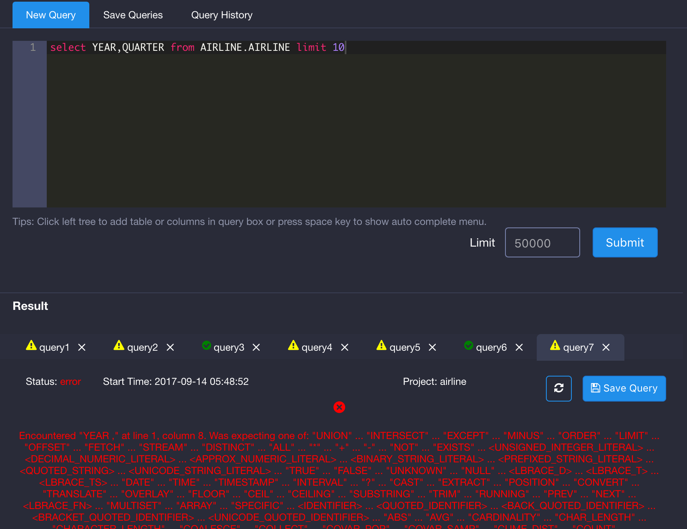
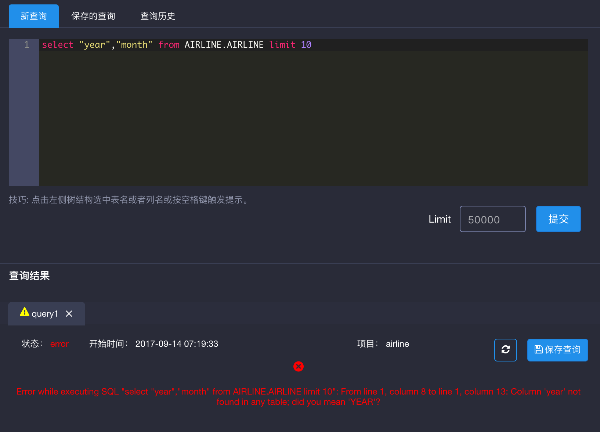
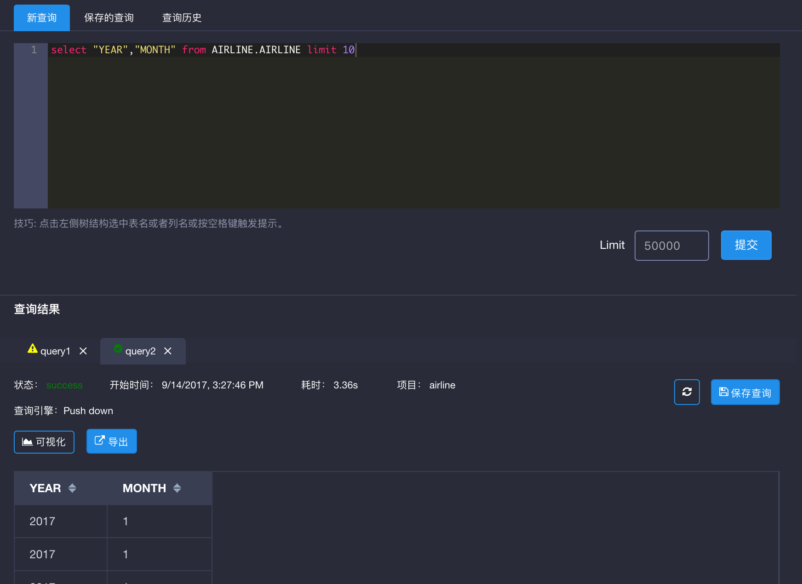
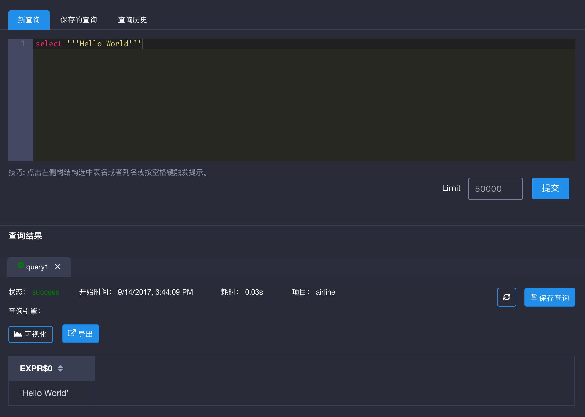

##SQL Syntax

KAP supports ANSI SQL 2003*, and its basic SQL grammar is listed as follows.

### Supported Syntax

```sql
statement:
|  query 

query:
      values
  |  WITH withItem [ , withItem ]* query
  |   {
          select
      |  selectWithoutFrom
      |  query UNION [ ALL | DISTINCT ] query
      |  query INTERSECT [ ALL | DISTINCT ] query
      }
      [ ORDER BY orderItem [, orderItem ]* ]
      [ LIMIT { count | ALL } ]
      [ OFFSET start { ROW | ROWS } ]
      [ FETCH { FIRST | NEXT } [ count ] { ROW| ROWS } ]

withItem:
      name
      ['(' column [, column ]* ')' ]
      AS '(' query ')'

orderItem:
      expression [ ASC | DESC ]［ NULLS FIRST |NULLS LAST ］

select:
      SELECT [ ALL | DISTINCT]
          { * | projectItem [, projectItem ]* }
      FROM tableExpression
      [ WHERE booleanExpression ]
      [ GROUP BY { groupItem [, groupItem ]* }]
      [ HAVING booleanExpression ]
      [ WINDOW windowName AS windowSpec [,windowName AS windowSpec ]* ]

selectWithoutFrom:
      SELECT [ ALL | DISTINCT ]
          { * | projectItem [, projectItem ]* }

projectItem:
      expression [ [ AS ] columnAlias ]
  |  tableAlias . *

tableExpression:
      tableReference [, tableReference ]*
  |  tableExpression [ NATURAL ]［( LEFT | RIGHT | FULL ) [ OUTER ] ］ JOINtableExpression [ joinCondition ]

joinCondition:
      ON booleanExpression
  |  USING '(' column [, column ]* ')'

tableReference:
      tablePrimary
      [ matchRecognize ]
      [ [ AS ] alias [ '(' columnAlias [,columnAlias ]* ')' ] ]

tablePrimary:
      [ [ catalogName . ] schemaName . ]tableName
      '(' TABLE [ [ catalogName . ] schemaName. ] tableName ')'
  |   [LATERAL ] '(' query ')'
  |  UNNEST '(' expression ')' [ WITH ORDINALITY ]
  |   [LATERAL ] TABLE '(' [ SPECIFIC ] functionName '(' expression [, expression ]*')' ')'

values:
      VALUES expression [, expression ]*
 
groupItem:
      expression
  |   '('')'
  |   '('expression [, expression ]* ')'
  |  GROUPING SETS '(' groupItem [, groupItem ]* ')'

windowRef:
      windowName
  |  windowSpec

windowSpec:
      [windowName ]
      '(' 
      [ ORDER BYorderItem [, orderItem ]* ]
      [ PARTITION BY expression [, expression]* ]
      [
          RANGE numericOrIntervalExpression {PRECEDING | FOLLOWING }
      |  ROWS numericExpression { PRECEDING | FOLLOWING }
      ]
    ')'
```

＊Different versions of the realization may be different. If you have any questions, please consult the technical support team.

### Keywords

The following is a list of SQL keywords. Reserved keywords are **bold**.

```sql
A, ABS, ABSOLUTE, ACTION, ADA, ADD, ADMIN, AFTER, ALL,ALLOCATE, ALLOW, ALTER, ALWAYS, AND, ANY, APPLY, ARE, ARRAY,ARRAY_MAX_CARDINALITY, AS, ASC, ASENSITIVE, ASSERTION, ASSIGNMENT, ASYMMETRIC, AT, ATOMIC, ATTRIBUTE, ATTRIBUTES,AUTHORIZATION, AVG, BEFORE, BEGIN, BEGIN_FRAME,BEGIN_PARTITION, BERNOULLI, BETWEEN, BIGINT, BINARY, BIT,BLOB, BOOLEAN, BOTH, BREADTH, BY, C, CALL, CALLED,CARDINALITY, CASCADE, CASCADED, CASE, CAST, CATALOG, CATALOG_NAME, CEIL, CEILING, CENTURY, CHAIN, CHAR,CHARACTER, CHARACTERISTICS, CHARACTERS,CHARACTER_LENGTH, CHARACTER_SET_CATALOG, CHARACTER_SET_NAME, CHARACTER_SET_SCHEMA,CHAR_LENGTH, CHECK, CLASSIFIER, CLASS_ORIGIN, CLOB, CLOSE,COALESCE, COBOL, COLLATE, COLLATION, COLLATION_CATALOG, COLLATION_NAME, COLLATION_SCHEMA, COLLECT, COLUMN, COLUMN_NAME, COMMAND_FUNCTION, COMMAND_FUNCTION_CODE, COMMIT, COMMITTED,CONDITION, CONDITION_NUMBER, CONNECT, CONNECTION, CONNECTION_NAME, CONSTRAINT, CONSTRAINTS, CONSTRAINT_CATALOG, CONSTRAINT_NAME, CONSTRAINT_SCHEMA, CONSTRUCTOR, CONTAINS, CONTINUE,CONVERT, CORR, CORRESPONDING, COUNT, COVAR_POP,COVAR_SAMP, CREATE, CROSS, CUBE, CUME_DIST, CURRENT,CURRENT_CATALOG, CURRENT_DATE,CURRENT_DEFAULT_TRANSFORM_GROUP, CURRENT_PATH,CURRENT_ROLE, CURRENT_ROW, CURRENT_SCHEMA,CURRENT_TIME, CURRENT_TIMESTAMP,CURRENT_TRANSFORM_GROUP_FOR_TYPE, CURRENT_USER,CURSOR, CURSOR_NAME, CYCLE, DATA, DATABASE, DATE, DATETIME_INTERVAL_CODE, DATETIME_INTERVAL_PRECISION,DAY, DEALLOCATE, DEC, DECADE, DECIMAL, DECLARE, DEFAULT, DEFAULTS, DEFERRABLE, DEFERRED, DEFINE, DEFINED, DEFINER, DEGREE, DELETE, DENSE_RANK, DEPTH, DEREF, DERIVED, DESC,DESCRIBE, DESCRIPTION, DESCRIPTOR, DETERMINISTIC, DIAGNOSTICS, DISALLOW, DISCONNECT, DISPATCH, DISTINCT, DOMAIN, DOUBLE, DOW, DOY, DROP, DYNAMIC, DYNAMIC_FUNCTION, DYNAMIC_FUNCTION_CODE, EACH,ELEMENT, ELSE, EMPTY, END, END-EXEC, END_FRAME,END_PARTITION, EPOCH, EQUALS, ESCAPE, EVERY, EXCEPT, EXCEPTION, EXCLUDE, EXCLUDING, EXEC, EXECUTE, EXISTS, EXP,EXPLAIN, EXTEND, EXTERNAL, EXTRACT, FALSE, FETCH, FILTER, FINAL, FIRST, FIRST_VALUE, FLOAT, FLOOR, FOLLOWING, FOR,FOREIGN, FORTRAN, FOUND, FRAC_SECOND, FRAME_ROW, FREE,FROM, FULL, FUNCTION, FUSION, G, GENERAL, GENERATED, GET,GLOBAL, GO, GOTO, GRANT, GRANTED, GROUP, GROUPING,GROUPS, HAVING, HIERARCHY, HOLD, HOUR, IDENTITY, IMMEDIATE, IMMEDIATELY, IMPLEMENTATION, IMPORT, IN, INCLUDING, INCREMENT, INDICATOR, INITIAL, INITIALLY, INNER,INOUT, INPUT, INSENSITIVE, INSERT, INSTANCE, INSTANTIABLE, INT,INTEGER, INTERSECT, INTERSECTION, INTERVAL, INTO, INVOKER, IS, ISOLATION, JAVA, JOIN, JSON, K, KEY, KEY_MEMBER, KEY_TYPE, LABEL, LAG, LANGUAGE, LARGE, LAST, LAST_VALUE, LATERAL, LEAD,LEADING, LEFT, LENGTH, LEVEL, LIBRARY, LIKE, LIKE_REGEX, LIMIT,LN, LOCAL, LOCALTIME, LOCALTIMESTAMP, LOCATOR, LOWER, M, MAP, MATCH, MATCHED, MATCHES, MATCH_NUMBER,MATCH_RECOGNIZE, MAX, MAXVALUE, MEASURES, MEMBER,MERGE, MESSAGE_LENGTH, MESSAGE_OCTET_LENGTH, MESSAGE_TEXT, METHOD, MICROSECOND, MILLENNIUM, MIN,MINUS, MINUTE, MINVALUE, MOD, MODIFIES, MODULE, MONTH, MORE, MULTISET, MUMPS, NAME, NAMES, NATIONAL, NATURAL,NCHAR, NCLOB, NESTING, NEW, NEXT, NO, NONE, NORMALIZE, NORMALIZED, NOT, NTH_VALUE, NTILE, NULL, NULLABLE, NULLIF, NULLS, NUMBER, NUMERIC, OBJECT, OCCURRENCES_REGEX, OCTETS, OCTET_LENGTH, OF, OFFSET, OLD, OMIT, ON, ONE, ONLY,OPEN, OPTION, OPTIONS, OR, ORDER, ORDERING, ORDINALITY, OTHERS, OUT, OUTER, OUTPUT, OVER, OVERLAPS, OVERLAY, OVERRIDING, PAD, PARAMETER, PARAMETER_MODE, PARAMETER_NAME, PARAMETER_ORDINAL_POSITION, PARAMETER_SPECIFIC_CATALOG, PARAMETER_SPECIFIC_NAME, PARAMETER_SPECIFIC_SCHEMA, PARTIAL, PARTITION, PASCAL, PASSTHROUGH, PAST, PATH, PATTERN, PER, PERCENT,PERCENTILE_CONT, PERCENTILE_DISC, PERCENT_RANK, PERIOD,PERMUTE, PLACING, PLAN, PLI, PORTION, POSITION,POSITION_REGEX, POWER, PRECEDES, PRECEDING, PRECISION,PREPARE, PRESERVE, PREV, PRIMARY, PRIOR, PRIVILEGES,PROCEDURE, PUBLIC, QUARTER, RANGE, RANK, READ, READS, REAL,RECURSIVE, REF, REFERENCES, REFERENCING, REGR_AVGX,REGR_AVGY, REGR_COUNT, REGR_INTERCEPT, REGR_R2,REGR_SLOPE, REGR_SXX, REGR_SXY, REGR_SYY, RELATIVE, RELEASE, REPEATABLE, REPLACE, RESET, RESTART, RESTRICT, RESULT,RETURN, RETURNED_CARDINALITY, RETURNED_LENGTH, RETURNED_OCTET_LENGTH, RETURNED_SQLSTATE, RETURNS,REVOKE, RIGHT, ROLE, ROLLBACK, ROLLUP, ROUTINE, ROUTINE_CATALOG, ROUTINE_NAME, ROUTINE_SCHEMA, ROW,ROWS, ROW_COUNT, ROW_NUMBER, RUNNING, SAVEPOINT, SCALE, SCHEMA, SCHEMA_NAME, SCOPE, SCOPE_CATALOGS, SCOPE_NAME, SCOPE_SCHEMA, SCROLL, SEARCH, SECOND, SECTION, SECURITY, SEEK, SELECT, SELF, SENSITIVE, SEQUENCE, SERIALIZABLE, SERVER, SERVER_NAME, SESSION, SESSION_USER,SET, SETS, SHOW, SIMILAR, SIMPLE, SIZE, SKIP, SMALLINT, SOME, SOURCE, SPACE, SPECIFIC, SPECIFICTYPE, SPECIFIC_NAME, SQL,SQLEXCEPTION, SQLSTATE, SQLWARNING, SQL_BIGINT, SQL_BINARY, SQL_BIT, SQL_BLOB, SQL_BOOLEAN, SQL_CHAR, SQL_CLOB, SQL_DATE, SQL_DECIMAL, SQL_DOUBLE, SQL_FLOAT, SQL_INTEGER, SQL_INTERVAL_DAY, SQL_INTERVAL_DAY_TO_HOUR, SQL_INTERVAL_DAY_TO_MINUTE, SQL_INTERVAL_DAY_TO_SECOND, SQL_INTERVAL_HOUR, SQL_INTERVAL_HOUR_TO_MINUTE, SQL_INTERVAL_HOUR_TO_SECOND, SQL_INTERVAL_MINUTE, SQL_INTERVAL_MINUTE_TO_SECOND, SQL_INTERVAL_MONTH, SQL_INTERVAL_SECOND, SQL_INTERVAL_YEAR, SQL_INTERVAL_YEAR_TO_MONTH, SQL_LONGVARBINARY, SQL_LONGVARCHAR, SQL_LONGVARNCHAR, SQL_NCHAR, SQL_NCLOB, SQL_NUMERIC, SQL_NVARCHAR, SQL_REAL, SQL_SMALLINT, SQL_TIME, SQL_TIMESTAMP, SQL_TINYINT, SQL_TSI_DAY, SQL_TSI_FRAC_SECOND, SQL_TSI_HOUR, SQL_TSI_MICROSECOND, SQL_TSI_MINUTE, SQL_TSI_MONTH, SQL_TSI_QUARTER, SQL_TSI_SECOND, SQL_TSI_WEEK, SQL_TSI_YEAR, SQL_VARBINARY, SQL_VARCHAR, SQRT, START, STATE, STATEMENT,STATIC, STDDEV_POP, STDDEV_SAMP, STREAM, STRUCTURE, STYLE, SUBCLASS_ORIGIN, SUBMULTISET, SUBSET, SUBSTITUTE,SUBSTRING, SUBSTRING_REGEX, SUCCEEDS, SUM, SYMMETRIC,SYSTEM, SYSTEM_TIME, SYSTEM_USER, TABLE, TABLESAMPLE, TABLE_NAME, TEMPORARY, THEN, TIES, TIME, TIMESTAMP, TIMESTAMPADD, TIMESTAMPDIFF, TIMEZONE_HOUR,TIMEZONE_MINUTE, TINYINT, TO, TOP_LEVEL_COUNT, TRAILING, TRANSACTION, TRANSACTIONS_ACTIVE, TRANSACTIONS_COMMITTED, TRANSACTIONS_ROLLED_BACK, TRANSFORM, TRANSFORMS, TRANSLATE, TRANSLATE_REGEX,TRANSLATION, TREAT, TRIGGER, TRIGGER_CATALOG, TRIGGER_NAME, TRIGGER_SCHEMA, TRIM, TRIM_ARRAY, TRUE,TRUNCATE, TYPE, UESCAPE, UNBOUNDED, UNCOMMITTED, UNDER, UNION, UNIQUE, UNKNOWN, UNNAMED, UNNEST,UPDATE, UPPER, UPSERT, USAGE, USER, USER_DEFINED_TYPE_CATALOG, USER_DEFINED_TYPE_CODE, USER_DEFINED_TYPE_NAME, USER_DEFINED_TYPE_SCHEMA,USING, VALUE, VALUES, VALUE_OF, VARBINARY, VARCHAR,VARYING, VAR_POP, VAR_SAMP, VERSION, VERSIONING, VIEW, WEEK, WHEN, WHENEVER, WHERE, WIDTH_BUCKET, WINDOW,WITH, WITHIN, WITHOUT, WORK, WRAPPER, WRITE, XML, YEAR, ZONE.
```


### Identifiers

Identifiers are the names of tables, columns and other metadata elements used in a SQL query.

Unquoted identifiers, such as `emp`, must start with a letter and can only contain letters, digits, and underscores. They are implicitly converted to upper case.

Quoted identifiers, such as `"Employee Name"`, start and end with double quotes. They may contain virtually any character, including spaces and other punctuation. If you wish to include a double quote in an identifier, use another double quote to escape it, like this: `"An employee called ""Fred""."`.

Matching identifiers to the name of the referenced object is case-sensitive. But remember that unquoted identifiers are implicitly converted to upper case before matching, and if the object it refers to was created using an unquoted identifier for its name, then its name will have been converted to upper case also.

### Escape Keywords 

If your column or table name use keywords, you will need to use double quote to escape it.  

For example, table `AIRLINE` contains column `YEAR` and `QUARTER` that overlap with KAP's keywords **YEAR** and **QUARTER**. As shown in the example below, if user query  `YEAR` and `QUARTER` directly, the query would return will error as KAP query engine fails to differentiate these two columns from keywords. 



When you try to escape column with a double quote, matching identifier to the name of the referenced object become case-sensitive (as mentioned above), KAP query engine will fail to query with double-quoted lower case letter as these columns are stored in capital letters in KAP.  

If we change the double-quoted column name to all capitals, the query will return correctly.



### Escape Quote

If your query contains single quote in the value, you can use another single quote to escape single quote in the value. 



For double quotes in the value, escape is not needed. 

