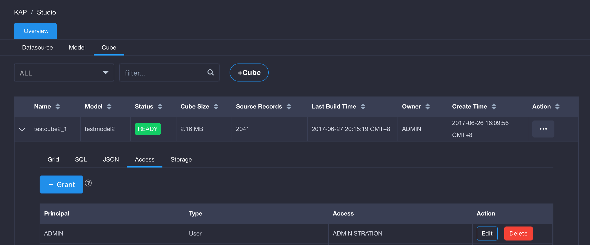

## Manage Permissions

What permissions does KAP provide?

- *QUERY*: Permission to query tables/cubes in the project
- *OPERATION*: Permission to rebuild, resume and cancel jobs. OPERATION permission includes QUERY.
- *MANAGEMENT*: Permission to edit/delete cube. MANAGEMENT permission includes OPERATION and QUERY.
- *ADMIN*: Full access to cube and jobs. ADMIN permission includes MANAGEMENT, OPERATION and QUERY.

### Manage Permissions at project level

It is suggested to configure permissions at project level rather than cube level.

#### Grant/Revoke

Follow the steps in above screenshot to grant permissions to user/role. Treat role as a user group.

Use the edit/delete button to update/revoke permissions.

### Manage Permissions at cube level

Administrators could customize different cubes with different permissions for each user/role:

### Influence

Permission at project level will be inherited by each cube in this project, e.g. If a user is granted MANAGEMENT
permission on a project, he naturally gets MANAGEMENT permission on all cubes this project. 

KAP will throw unauthorized exception on user's query unless the user has QUERY permission to the selected cube. The permission 
could either be at project level or cube level.

Additionally, when Query Pushdown is enabled, QUERY permission on project allows users to issue pushdown queries on all tables in the project even though no cube could serve them. It's impossible if
a user is not yet granted QUERY permission at project level.
