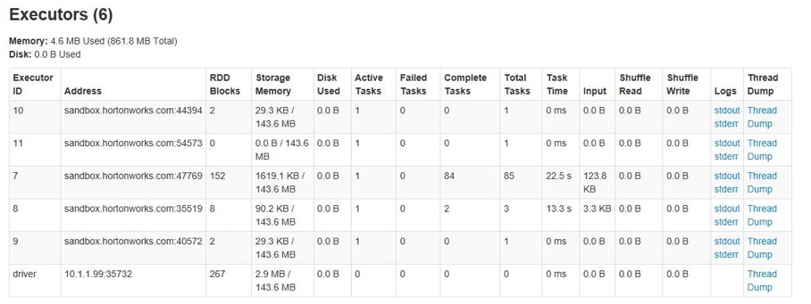

## Spark动态资源分配

Spark中，所谓资源单位一般指的是executors，和Yarn中的Containers一样，在Spark On Yarn模式下，通常使用num-executors来指定Application使用的executors数量，而executor-memory和executor-cores分别用来指定每个executor所使用的内存和虚拟CPU核数。

以KAP为例，如果用户使用KAP的时候使用的是固定的资源分配策略，启动时候指定num-executors 3，那么每个KAP instance都会一直占用４个YARN的container（１个固定用于application master，3个用于executor），这4个资源就会一直被占用着，只有当用户退出时才会释放。但是，如果可以将资源分配的策略设置为Dynamic Resource Allocation，则Spark可以根据KAP查询的负载情况，动态的增加和减少executors，从而大幅度节省资源。

Spark动态资源分配详细介绍请见官方文档：http://spark.apache.org/docs/1.6.2/job-scheduling.html#dynamic-resource-allocation

### Spark动态资源分配配置方法

#### 概览
Spark动态资源分配需要配置两处：一处是集群的资源管理器相关配置，会根据资源管理器的不同（YARN、Mesos、Standalone）有不同的配置方式。另外，动态资源分配还需要配置spark-default.conf文件（在KAP中，可以直接配置kylin.properties文件，KAP会自动转换为spark的配置），此处配置相对固定。

#### 资源管理器配置
##### CDH

1. 登入Cloudera Manager，选择YARN configuration，找到NodeManager Advanced Configuration Snippet （Safety Valve） for yarn-site.xml，配置如下：
`<property>`
`<name>yarn.nodemanager.aux-services</name>`
`<value>mapreduce_shuffle，spark_shuffle</value>`
`</property>`
`<property>`
`<name>yarn.nodemanager.aux-services.spark_shuffle.class</name>`
`<value>org.apache.spark.network.yarn.YarnShuffleService</value>`
`</property>`

2. 将$KYLIN_HOME/spark/lib/spark-<version>-yarn-shuffle.jar文件拷贝出来，放到Hadoop节点的/opt/lib/kap/目录下（路径可修改）。

    在Cloudera Manager中找到NodeManager Environment Advanced Configuration Snippet （Safety Valve），配置:
    `YARN_USER_CLASSPATH=/opt/lib/kap/*`
    则yarn-shuffle.jar文件会被加入Node Manager启动时的class path中。

3. 保存配置并重启
    在Cloudera Manager中，选择actions --> deploy client configuration，保存后，重启所有service。

##### HDP
1. 登陆Ambari管理页面，选择Yarn -> Configs -> Advanced，通过Filter找到以下配置项并进行更改：
`yarn.nodemanager.aux-services.spark_shuffle.class=org.apache.spark.network.yarn.YarnShuffleService`

2. 将$KYLIN_HOME/spark/lib/spark-<version>-yarn-shuffle.jar文件拷贝出来，放到hadoop节点的$HDP_HOME/hadoop/lib路径下。

3. 保存配置并重启

#### KAP配置
配置Spark动态资源分配需要在Spark的配置文件中添加一些配置项以开启该服务。由于在KAP中可以通过在kylin.properties中进行配置来直接覆盖Spark中的配置，因此只需要在kylin.properties中进行如下配置：

`kap.storage.columnar.spark-conf.spark.executor.instances=0`

`kap.storage.columnar.spark-conf.spark.dynamicAllocation.enabled=true`

`kap.storage.columnar.spark-conf.spark.dynamicAllocation.maxExecutors=5`

`kap.storage.columnar.spark-conf.spark.dynamicAllocation.minExecutors=1`

`kap.storage.columnar.spark-conf.spark.shuffle.service.enabled=true`

`kap.storage.columnar.spark-conf.spark.dynamicAllocation.initialExecutors=3`

更多配置项可以参考：
http://spark.apache.org/docs/latest/configuration.html#dynamic-allocation

### Spark动态资源分配验证
配置完成后，启动KAP Plus，在executor页面中可以观察当前的executor数目。

由于executor处于空闲状态，因此一定时间后会被撤除，直至达到配置项中设定的最小值。

利用Restful API，使用多个线程向KAP Plus提交查询。一定时间后会观察到executor数目增加，但不会超过配置项中设定的最大值。

