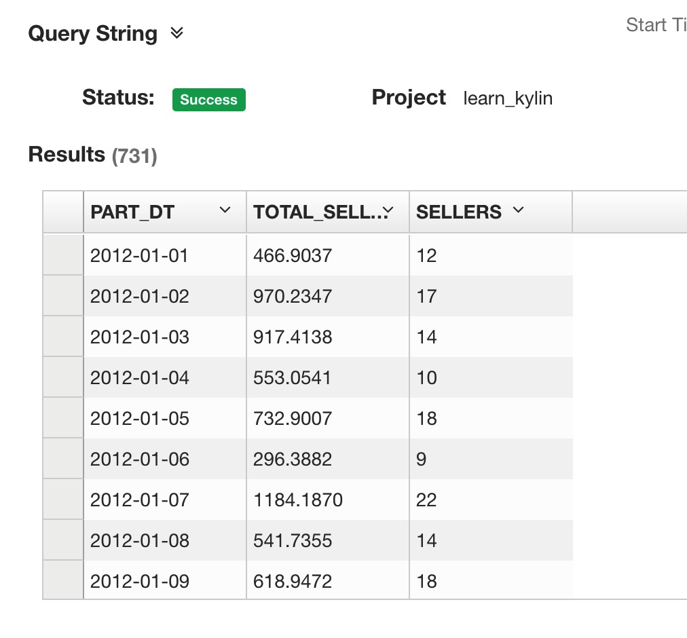

## 单节点部署（基于CDH）

通常部署单个KAP节点，已经能够满足中小规模(QPS<50)的查询需求；单节点部署具有简单、快速的特点。部署过程即上一节的安装过程，下图是一个单节点部署的示意图。


在单节点部署中，尤其是部署在沙箱中，以下的配置项值得注意。其中`yarn.nodemanager.resource.cpu-vcores`涉及CPU资源的分配，其他的配置项则是关于内存资源的分配。关于配置项的具体解释，请参考[Hadoop的官方网站](https://hadoop.apache.org/docs/r2.7.3/hadoop-yarn/hadoop-yarn-common/yarn-default.xml)。

- yarn.nodemanager.resource.cpu-vcores
- yarn.scheduler.maximum-allocation-mb
- yarn.nodemanager.resource.memory-mb
- mapreduce.map.memory.mb
- mapreduce.reduce.memory.mb
- mapreduce.map.java.opts
- mapreduce.reduce.java.opts

KAP发布了一些数据包，其中包含一些数据集样例和Cube。用户可以通过执行示例脚本轻松地导入数据集和Cube。欲悉更多关于安装和使用工具的详细信息，请参考其他相关指南。

### 准备环境

KAP需要在Hadoop节点上运行，为了获得更好的稳定性，我们建议您部署一个纯Hadoop客户机， 将一些指令，例如*hive, hbase, hadoop, hdfs*，提前安装配置好。为了使准备事宜更简便，我们建议您尝试将KAP和 *All-in-one* sandbox VM这类沙盒软件配合使用，比如*Hortonworks Sandbox 2.2* 和*Cloudera QuickStart VM 5.7*。最小内存配置需要10GB。

> 由于不同的沙盒软件配套于不同的HBase版本，请安装KAP相应的配置文件。
>
> 在*HDP 2.2*上，请使用*HBase 0.98* 配置；
>
> 在*HDP 2.3+*上，请使用*HBase 1.x* 配置；
>
> 在*CDH 5.7+上，请使用*CDH*配置；

为了避免沙盒软件中的权限问题，你可以使用它的*root*帐户通过SSH。*Hortonworks Sandbox 2.2* 的密码为“*hadoop*”。*Horonworks Sandbox 2.3+*的密码参见 [Hortonworks Documents](http://zh.hortonworks.com/hadoop-tutorial/learning-the-ropes-of-the-hortonworks-sandbox/)。*Cloudera QuickStart VM 5.7+*的密码为 *cloudera*。

本指南将用*cloudera*作为案例. 

在Virtual Box的设置中，我们也推荐您使用*bridged adapter*模型替代NAT模型。*Bridged Adapter*模型将给您的沙盒软件分配一个独立的IP地址，使您既可以通过本地访问KAP网页，也可以远程访问KAP网页。

请确保下列服务（HDFS/YARN/Hive/HBase/ZooKeeper）正常运作，并无任何警告信息（登录 Ambari Portal  [http://{hostname}:7180](http://{hostname}:7180) ，默认的用户名为“*cloudera*”，初始密码为“*cloudera*“）。


为了满足KAP的资源需求，以下参数应及时更新。

1. 对于*CDH 5.7+*，请更新*yarn.nodemanager.resource.memory-mb*到8192mb（或者在 cloudera manager上配置 8 GB ），更新*yarn.scheduler.maximum-allocation-mb*到4096mb （或者在 cloudera manager上配置 4 GB ），更新*mapreduce.reduce.memory.mb*到700mb, 更新*mapreduce.reduce.java.opts*到 512mb。
2. 如遇到如下信息 *org.apache.hadoop.hbase.security.AccessDeniedException: Insufficient permissions for user 'root (auth:SIMPLE)'*，则意味着未得到足够的HBase的书写权限。如果您希望关闭HBase的权限检查，请更新以下对应信息：将*hbase.coprocessor.region.classes* 和*hbase.coprocessor.master.classes*更新为*empty*，将*hbase.security.authentication*更新为 *simple*。

### 安装KAP

请访问 [KAP release notes](../release/README.md)获取KAP软件包。以下步骤针对KAP，KAP Plus步骤略有不同。

拷贝KAP二进制包至安装机器，并解压至安装目录，本文以*/usr/local*为例

```shell
cd /usr/local
tar -zxvf kap-{version}-{hbase}.tar.gz 
```

设置环境变量`KYLIN_HOME` 为KAP的主目录。

```shell
export KYLIN_HOME=/usr/local/kap-{version}-{hbase}
```

> KAP Plus需要启动Spark Executor，会占用更多YARN资源，作为单机测试，需要调低Executor占用资源数，请添加（或替换）以下参数：
>
> kap.storage.columnar.conf.spark.driver.memory=512m
>
> kap.storage.columnar.conf.spark.executor.memory=512m
>
> kap.storage.columnar.conf.spark.executor.cores=1
>
> kap.storage.columnar.conf.spark.executor.instances=1

在HDFS中创建KAP的工作目录，并授予KAP特殊权限与读写权限。

```shell
hdfs dfs -mkdir /kylin
hdfs dfs -mkdir /user/cloudera
```

> 如果在HDFS上没有读写权限，请先转至hdfs账户，然后创建目录，再授予权限。 

```shell
su hdfs
hdfs dfs -mkdir /kylin
hdfs dfs -chown cloudera /kylin
hdfs dfs -mkdir /user/cloudera
hdfs dfs -chown cloudera /user/cloudera
```

### 环境检查

KAP运行时需要依赖环境信息，通过环境变量读取，这些变量包括：HADOOP_CONF_DIR，HIVE_LIB，HIVE_CONF，和HCAT_HOME。样例配置如下

```shell
export HADOOP_CONF_DIR=/etc/hadoop/conf
export HIVE_LIB=/usr/lib/hive
export HIVE_CONF=/etc/hive/conf
export HCAT_HOME=/usr/lib/hive-hcatalog
```

可通过执行bin/check-env.sh 验证环境是否符合KAP运行需求。

### 导入数据样例和Cube

`bin/sample.sh`会创建5个Hive Table，并导入样例数据。数据导入成功后，会自动创建样例项目、模型和Cube定义。 

```shell
cd kap-{version}-{hbase}
bin/sample.sh
```

在成功的执行之后，提示将如下（项目名称为“learn_kylin”并需要用户在系统页面重新导入metadata）：

> Sample cube is created successfully in project 'learn_kylin'.
> Restart Kylin server or reload the metadata from web UI to see the change.

### 启动KAP

进入KAP的主目录，然后运行脚本`bin/kylin.sh start`。

```shell
cd kap-{version}-{hbase}
bin/kylin.sh start
```

KAP正常启动之后，可以通过浏览器访问，默认地址[http://{hostname}:7070/kylin](http://{hostname}:7070/kylin)，默认用户名ADMIN，密码KYLIN。

### 构建Cube

进入KAP后，通过页面左上角的下拉菜单选择样例项目*learn_kylin*。


进入**模型**页面，选择样例Cube *kylin_sales_cube*，选择*操作*->*构建*，选择一个晚于*2014-01-01*的结束日期，这样会包含全部10000条原始数据，并提交。


进入**监控**页面，可以看到正在构建的Cube任务，可以点击*刷新*，获得最新进度，直到100%。

### 执行SQL

当Cube构建成功后，进入**查询**页面，可以在页面左侧看到之前导入的五张表，这时可以输入SQL语句，对样例数据进行查询分析。样例语句包括：

```sql
select part_dt, sum(price) as total_selled, count(distinct seller_id) as sellers from kylin_sales group by part_dt order by part_dt
```

查询的结果会呈现在页面中，可以对比Hive验证查询的结果和响应的速度。

