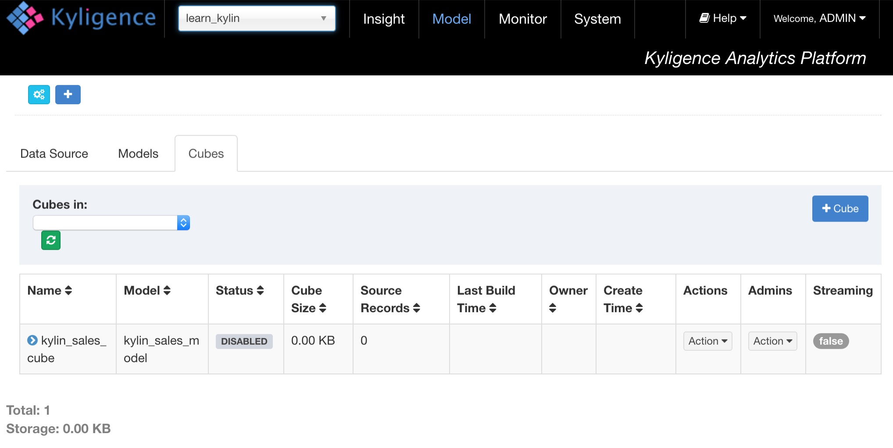

## 在HDP沙箱快速安装HDP

KAP发布了一些数据包，其中包含一些数据集样例和Cube。用户可以通过执行示例脚本轻松地导入数据集和Cube。欲悉更多关于安装和使用工具的详细信息，请参考其他相关指南。

### 环境准备

KAP需要在Hadoop节点上运行，为了获得更好的稳定性，我们建议您部署一个纯Hadoop客户机， 将一些指令，例如*hive, hbase, hadoop, hdfs*，提前安装配置好。为了使准备事宜更简便，我们建议您尝试将KAP和 *All-in-one* sandbox VM这类沙盒软件配合使用，比如*Hortonworks Sandbox（HDP）* 和*Cloudera QuickStart VM（CDH）*。虚拟机需要至少*10G*内存。

> 由于不同的沙盒软件配套于不同的HBase版本，请安装KAP相应的发行版。
>
> 在*HDP 2.2*上，请使用*HBase 0.98* 对应发行版；*HDP 2.3+*上，请使用*HBase 1.x* 对应发行版；
>
> 在*CDH 5.7+*上，请使用*CDH*对应发行版；

为了避免权限问题，我们建议使用*root*账号通过SSH的方式登录虚拟机，*HDP 2.2*的默认密码是*hadoop*， *HDP 2.3+* 请参考[Hortonworks文档](http://zh.hortonworks.com/hadoop-tutorial/learning-the-ropes-of-the-hortonworks-sandbox/)了解账号密码。

以下指南以*root*账户为例。

我们建议采用网桥（bridged）模式配置虚拟机网络，网桥模式将为虚拟机分配独立IP地址，方便本机访问KAP Web页面。

登录Ambari管理门户, [http://{hostname}:8080](http://{hostname}:8080)(默认登录用户名admin, 密码admin)确认HDFS/MapReduce2/YARN/Hive/HBase/ZooKeeper都处于正常运行状态，没有警告信息，可以针对每个服务运行*Service Check*以确认服务状态，特别是HBase服务，需要运行Service Check验证读写权限。


以下配置需要修改，以配合KAP的资源需求

1. 针对*HDP 2.2*，找到YARN-Configs，修改*yarn.nodemanager.resource.memory-mb*为*8192*，*yarn.scheduler.maximum-allocation-mb*为*4096*；针对*HDP 2.3/2.4*，找到YARN-Configs->Settings，修改*Memory Node*为*8192*
2. 针对*HDP 2.3+*，找到MapReduce2-Configs->Advanced，修改*MR Map Java Heap Size*及*MR Reduce Java Heap Size*为 *-Xmx3072m*
3. 如果遇到*org.apache.hadoop.hbase.security.AccessDeniedException: Insufficient permissions for user 'root (auth:SIMPLE)'*这样的异常，表示没有写HBase的权限，可以将*hbase.coprocessor.region.classes*和*hbase.coprocessor.master.classes*设置为空，*hbase.security.authentication*设置为*simple*，*hbase.security.authorization*设置为*false*，以关闭HBase的权限验证。

### 启动 Hadoop

用ambari来启动hadoop

```shell
ambari-agent start
ambari-server start
```

命令成功之后，登录ambari  [http://{hostname}:8080](http://{hostname}:8080) (默认登录用户名admin, 密码admin)来检查各项状态。

默认Hbase是禁用的，需要在ambari 主页启动Hbase服务。

 

### 安装KAP

获取KAP安装包请参考[KAP发行说明](../release/README.md)。以下步骤针对KAP，KAP Plus步骤略有不同。

拷贝KAP二进制包至安装机器，并解压至安装目录，本文以*/usr/local*为例

```shell
cd /usr/local
tar -zxvf kap-{version}-{hbase}.tar.gz
```

设置环境变量`KYLIN_HOME`为KAP的解压缩目录。

```shell
export KYLIN_HOME=/usr/local/kap-{version}-{hbase}
```

在HDFS上创建KAP工作目录，并授权KAP启动用户读写权限。

```shell
hdfs dfs -mkdir /kylin
hdfs dfs -mkdir /user/root
```

> 如果遇到没有HDFS写权限问题，可以先切换到hdfs账号，创建目录，再授权给*root*账户。
>

```shell
su hdfs
hdfs dfs -mkdir /kylin
hdfs dfs -chown root /kylin
hdfs dfs -mkdir /user/root
hdfs dfs -chown root /user/root
```

由于沙箱环境资源有限，可以首先切换到最小化资源配置模版。

```shell
cd $KYLIN_HOME/conf

# Use sandbox(min) profile
ln -sfn profile_min profile
```

### 环境检查

KAP运行时需要依赖环境信息，通过环境变量读取，这些变量包括：HADOOP_CONF_DIR，HIVE_LIB，HIVE_CONF，和HCAT_HOME。样例配置如下

```shell
export HADOOP_CONF_DIR=/etc/hadoop/conf
export HIVE_LIB=/usr/lib/hive
export HIVE_CONF=/etc/hive/conf
export HCAT_HOME=/usr/lib/hive-hcatalog
```

可通过执行bin/check-env.sh 验证环境是否符合KAP运行需求。

### 导入样例数据和模型

`bin/sample.sh`会创建5个Hive Table，并导入样例数据。数据导入成功后，会自动创建样例项目、模型和Cube定义。

```shell
cd kap-{version}-{hbase}
bin/sample.sh
```

成功执行的脚本，最后的输出如下（项目名称为“learn_kylin”并需要用户在系统页面重新导入metadata）：

> Sample cube is created successfully in project 'learn_kylin'.
> Restart Kylin server or reload the metadata from web UI to see the change.

### 启动KAP

进入KAP安装目录，并执行启动脚本`bin/kylin.sh start`。

```shell
cd kap-{version}-{hbase}
bin/kylin.sh start
```

KAP正常启动之后，可以通过浏览器访问，默认地址[http://{hostname}:7070/kylin](http://{hostname}:7070/kylin)，默认用户名ADMIN，密码KYLIN。

### 构建Cube

进入KAP后，通过页面左上角的下拉菜单选择样例项目*learn_kylin*。



进入**模型**页面，选择样例Cube *kylin_sales_cube*，选择*操作*->*构建*，选择一个晚于*2014-01-01*的结束日期，这样会包含全部10000条原始数据，并提交。


进入**监控**页面，可以看到正在构建的Cube任务，可以点击*刷新*，获得最新进度，直到100%。


### 执行SQL查询

当Cube构建成功后，进入**查询**页面，可以在页面左侧看到之前导入的五张表，这时可以输入SQL语句，对样例数据进行查询分析。样例语句包括：

```sql
select part_dt, sum(price) as total_selled, count(distinct seller_id) as sellers from kylin_sales group by part_dt order by part_dt
```

查询的结果会呈现在页面中，可以对比Hive验证查询的结果和响应的速度。


