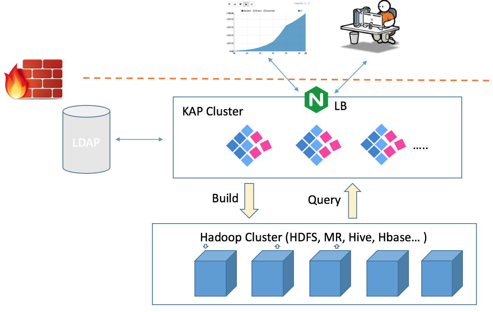

## 负载均衡与集群部署
KAP 实例是无状态的服务，所有的状态信息都存储在 metastore（如HBase，JDBC source）中。因此，您可以启用多个 KAP 节点以部署负载均衡集群，使各个节点分担查询压力且互为备份，从而提高服务的可用性，其部署架构如图所示：



### KAP 节点配置

如果您需要将多个 KAP 节点组成集群，请确保它们使用同一个 Hadoop 集群和 HBase 集群。然后，请您执行下述步骤：

1. 在各 KAP 节点的`$KYLIN_HOME/conf/kylin.properties`配置文件中，为各节点配置相同的`kylin.metadata.url`值，即令各 KAP 节点使用同一个 HBase metastore；

2. 选择其中一个 KAP 节点，配置`kylin.server.mode=all`以将该实例同时作为任务引擎和查询引擎；为其他 KAP 节点配置`kylin.server.mode=query`以使得它们仅作为查询引擎。

   > 如果您需要启用任务引擎高可用，请参考[服务发现及任务引擎高可用](advancing_installation_ha.cn.md)。

3. 将所有 KAP 实例的地址和端口更新至每个节点的`kylin.server.cluster-servers`，如：

   ```shell
   kylin.server.cluster-servers=1.1.1.1:7070,1.1.1.2:7070
   ```

   上述地址和端口将被用于多个 KAP 实例之间的元数据状态同步。

### 负载均衡配置

为了将查询请求发送给集群而非单个节点，您应当部署一个负载均衡器（Load Balancer），如 Apache HTTP Server 或 Nginx。负载均衡器采用一定的策略决定将某个请求分发给某个节点，并且在该节点失效时重试其他节点。需要提交查询请求的用户通过负载均衡器的地址来访问 KAP。为了便于用户和角色的管理，在这样的使用情景下通常会启用 LDAP 安全验证。

以 Nginx 为例，首先您应当为KAP 站点新建一个配置文件（如kylin.conf），内容如下：

```shell
upstream kylin {
    server 1.1.1.1:7070; # Kylin Server 1
    server 1.1.1.2:7070; # Kylin Server 2
}
server {
    listen 8080;
    location / {
        proxy_pass http://kylin;
    }
}
```
Nginx 在默认情况下将以轮询的方式分发请求。如果一个 KAP 实例失效，将会被自动剔除。但在默认情况下，KAP 用户的 Session 信息是保存在本地的，因此当同一个用户的多个请求发送给不同 KAP 实例时，并非所有的实例都能识别用户的登陆信息。

对于这种情况，您可以简单地配置 Nginx 使用 ip_hash 的方式，将每个请求按照客户端 ip 的 hash 结果固定地分发至某个 KAP 实例。

如果您需要回避 ip_hash 可能导致的 KAP 实例的负载不均衡（例如只有少量应用服务器频繁访问 KAP，导致大部分查询请求被分发给少数 KAP 实例），您应当在 KAP 中进行相关配置，将 Session 信息保存至 Redis 集群（或 MySQL、MemCache 等）中，实现多个 KAP 实例的 Session 共享。为此，您只需要简单修改 Tomcat 配置文件即可，步骤如下：

1. 执行下述命令以下载 Redis 相关的 jar 包并将其放置在`$KYLIN_HOME/tomcat/lib/`路径下：

   ```shell
   wget http://central.maven.org/maven2/redis/clients/jedis/2.0.0/jedis-2.0.0.jar
   wget http://central.maven.org/maven2/org/apache/commons/commons-pool2/2.2/commons-pool2-2.2.jar
   wget https://github.com/downloads/jcoleman/tomcat-redis-session-manager/tomcat-redis-session-manager-1.2-tomcat-7-java-7.jar
   ```


2. 在`$KYLIN_HOME/tomcat/context.xml`中添加如下内容：

   ```xml
   <Valve className="com.radiadesign.catalina.session.RedisSessionHandlerValve" />
   <Manager className="com.radiadesign.catalina.session.RedisSessionManager" host="localhost" port="6379" database="0" maxInactiveInterval="60"/>
   ```

   其中，host 和 port 指向所使用的 Redis 集群的地址。

### 单节点多实例部署

KAP 支持在单节点上运行多个实例运行查询引擎以实现负载均衡。

如果您需要进行单节点多实例部署，请确保多个实例无端口冲突。为此，请在`${KYLIN_HOME}/tomcat/conf/server.xml`中为每个实例重新配置端口。然后，请您执行下述步骤：

1. 在各 KAP 节点的`$KYLIN_HOME/conf/kylin.properties`配置文件中，为各节点配置相同的`kylin.metadata.url`值，即令各 KAP 节点使用同一个 HBase metastore；

2. 选择其中一个 KAP 实例，配置`kylin.server.mode=all`以将该实例同时作为任务引擎和查询引擎；为其他 KAP 实例配置`kylin.server.mode=query`以使得它们仅作为查询引擎。

   > 如果您需要启用任务引擎高可用，请参考[服务发现及任务引擎高可用](advancing_installation_ha.cn.md)。

3. 将所有 KAP 实例的地址和端口更新至每个节点的`kylin.server.cluster-servers`，如：

   ```shell
   kylin.server.cluster-servers=1.1.1.1:7070,1.1.1.2:7070
   ```

   上述地址和端口将被用于多个 KAP 实例之间的元数据状态同步。