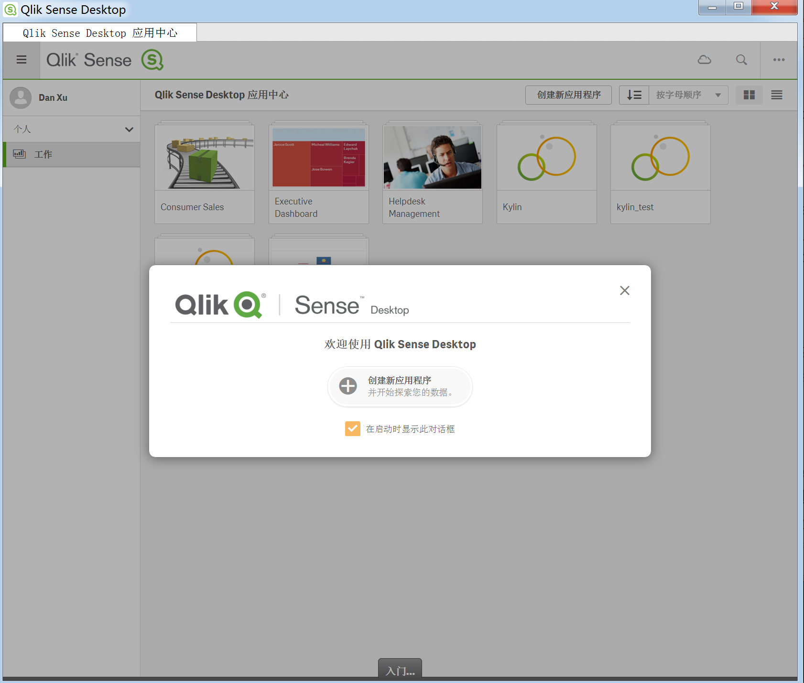
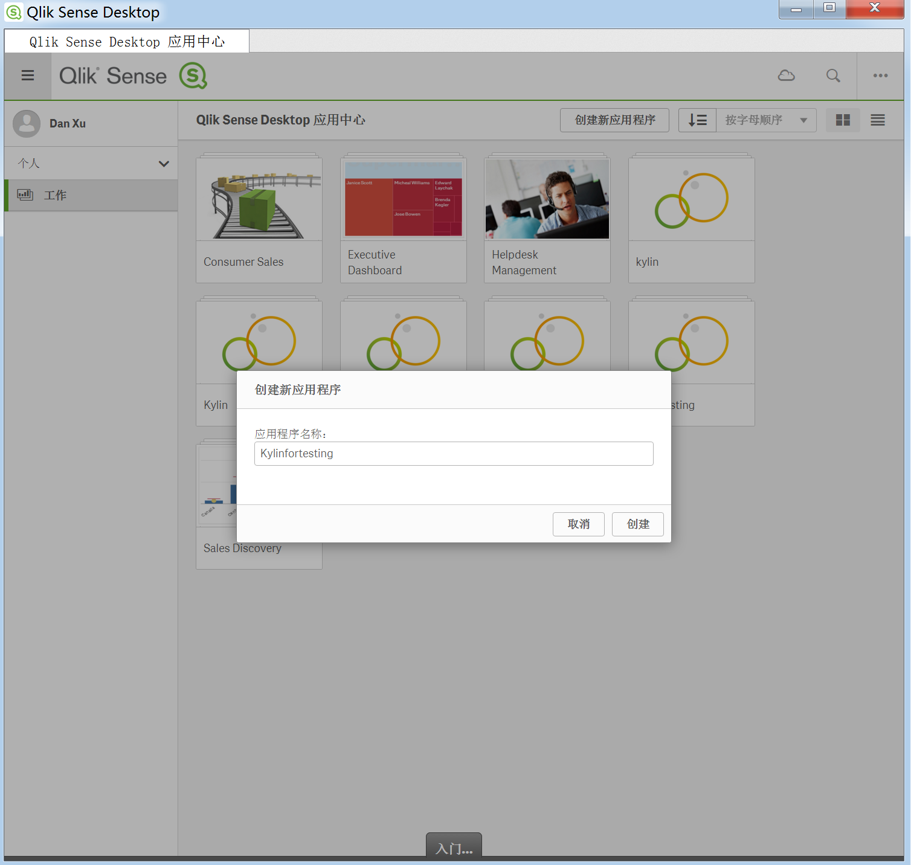
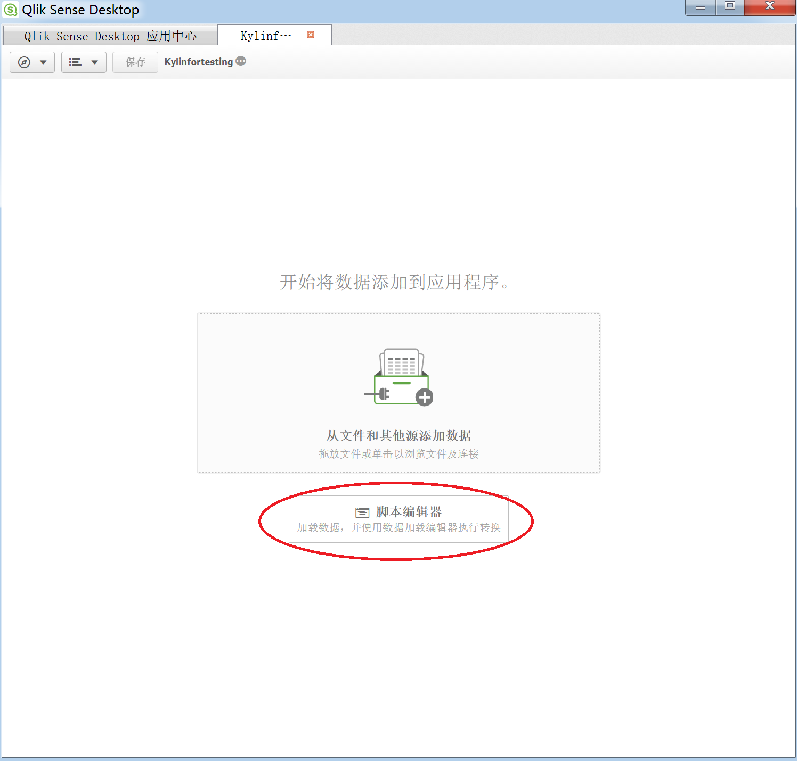
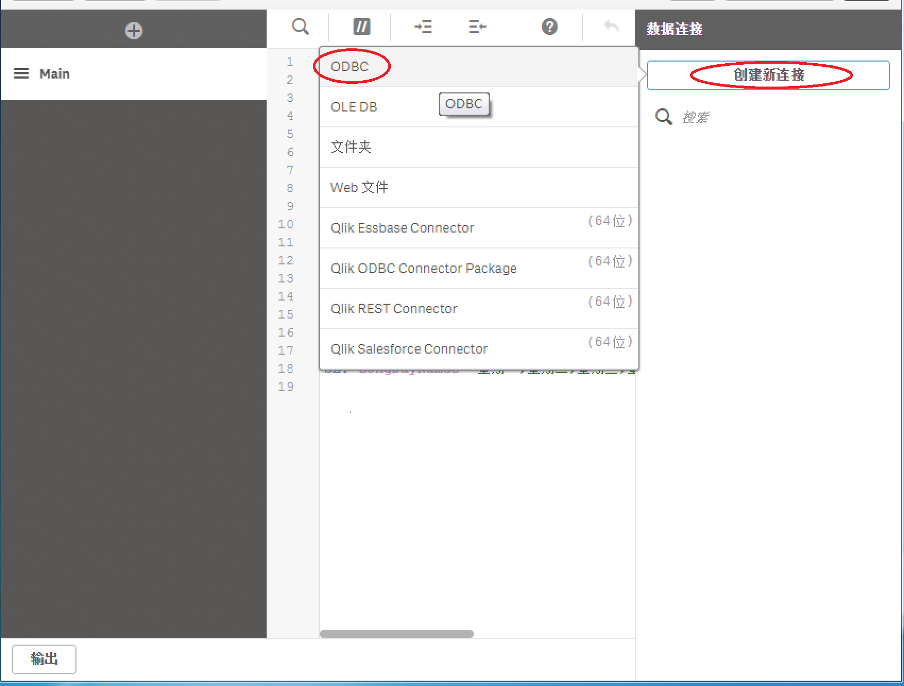
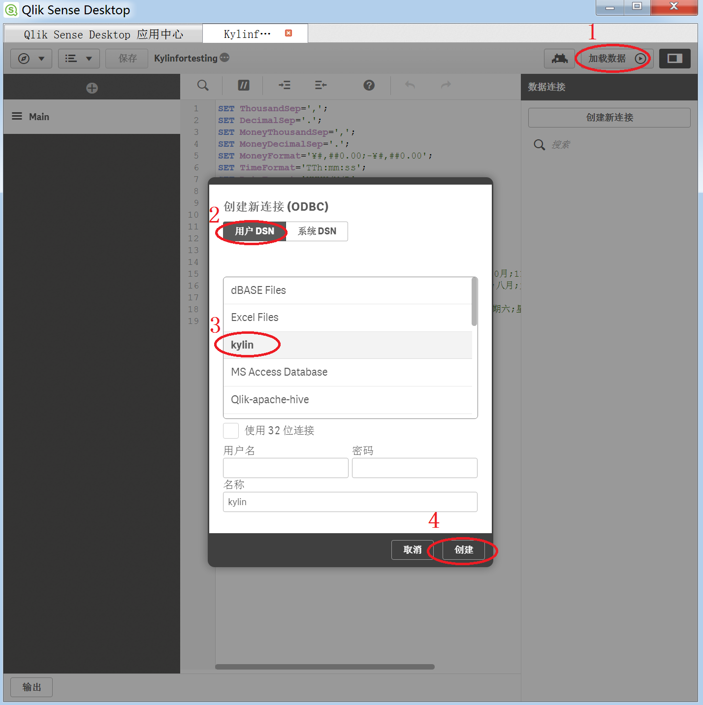
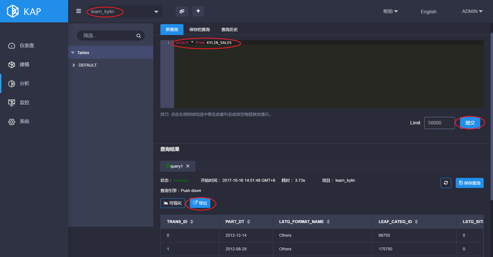
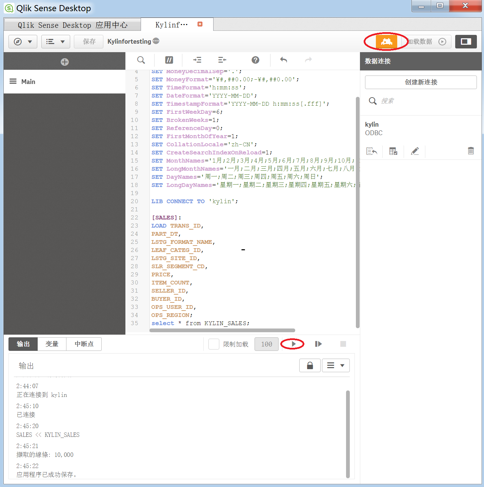
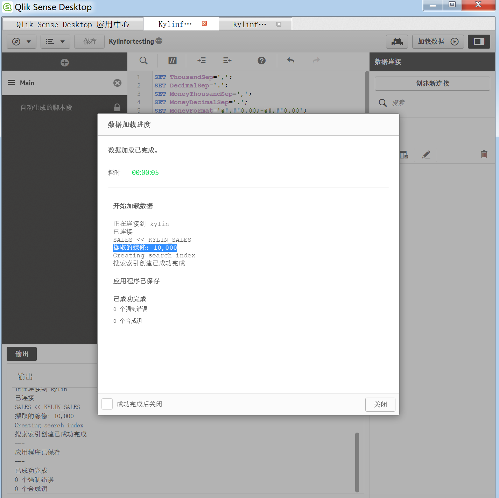
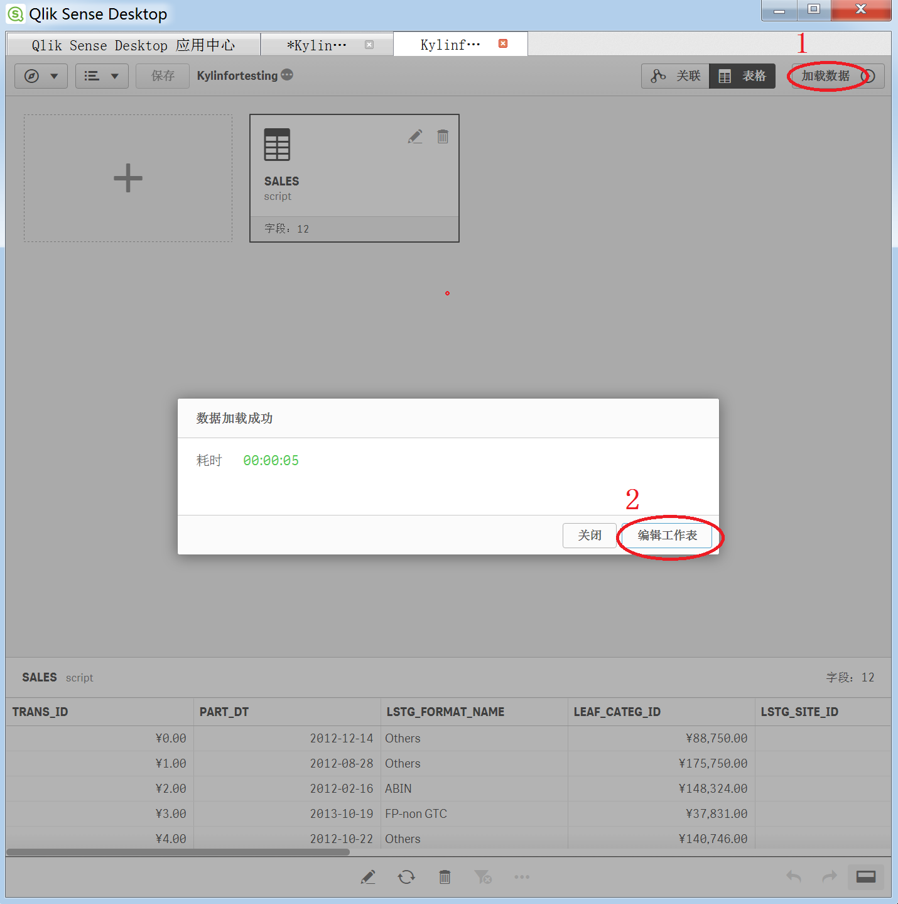
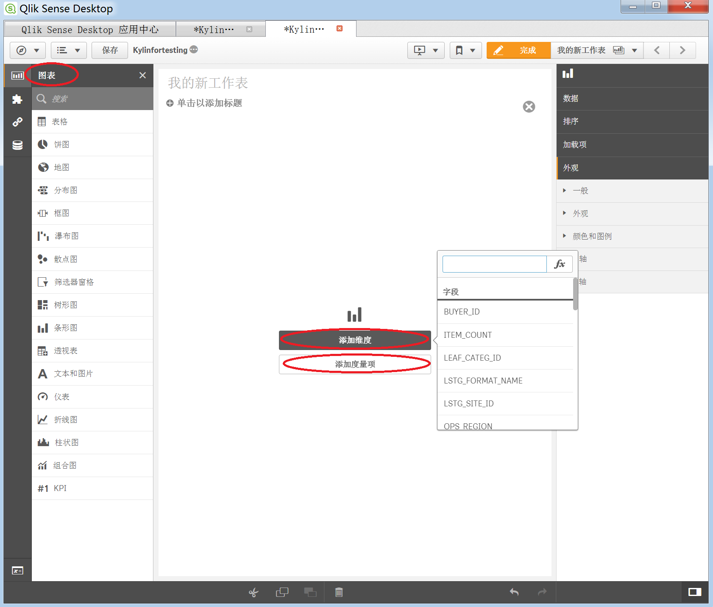

## 与 Qlik Sense 集成

Qlik Sense 是新一代自助式数据可视化工具。它是一款完整的商业分析软件，便于开发人员和分析人员快速构建和部署强大的分析应用。近年来，该工具成为全球增长率最快的 BI 产品。它可以与 Hadoop Database（Hive 和 Impala）集成。现在也可与 KAP 集成。本文将分步指导您完成 KAP 与 Qlik Sense 的连接。

### 前提条件

在与 Qlik Sense 集成之前，务必先安装并下载下列应用程序。如果您的机器上已经安装 Kylin ODBC 驱动程序，请先将它卸载。

- [Kylin ODBC](http://kylin.apache.org/docs15/tutorial/odbc.html)
- [Qlik Sense Desktop](http://www.qlik.com/us/try-or-buy/download-qlikview)

详细安装和配置说明见下。

#### 配置本地 DSN

参阅 [ODBC 驱动程序](http://docs.kyligence.io/v2.5/en/driver/odbc.en.html)页面上的说明，安装和配置本地 DSN。执行完该页面上的步骤后，系统将弹出对话框  **Apache Kylin DSN Configuration**，选择 **learn_kylin** 项目，然后单击 **Done**。

*图 1. Apache Kylin DSN 配置*

#### 安装 Qlik Sense

有关 Olik Sense 的安装说明，请访问 [Qlik Sense Desktop 下载页面](https://www.qlik.com/us/try-or-buy/download-qlik-sense)。

### 与 Qlik Sense 连接
配置完本地 DSN 并成功安装 Qlik Sense 后，可执行以下步骤来连接 Kylin 与 Qlik Sense：

1. 从 Windows 桌面快捷方式或单击**开始 -> 所有程序 -> Qlik Sense -> Qlik Sense Desktop**，打开应用程序 **Qlik Sense Desktop**。

2. 输入 Qlik 用户名和密码，接着系统将弹出以下对话框。单击**创建新应用程序**。

*图 2. 创建新应用程序*

为新建的应用程序指定名称，该名称不得与现有的应用程序相同。创建完成后，打开此应用程序。在本例中，我们将此应用程序命名为“Kylinfortesting”。

*图 3. 为新的应用程序命名*

3. 应用程序视图中有两个选项，选择下方的**脚本编辑器**。

*图 4. 选择脚本编辑器*

此时会显示 Kylinfortesting | Data Load Editor 窗口。单击页面右上方的**创建新连接**。

*图 5. 新建数据连接*

然后选择 **ODBC -> kylin**，不需要填写帐户信息，单击**创建**即可。

*图 6. ODBC 连接*

4. 将 "TimeFormat"、"DateFormat" 和 "TimestampFormat" 的默认脚本更改为：

`SET TimeFormat='h:mm:ss';`
`SET DateFormat='YYYY-MM-DD';`
`SET TimestampFormat='YYYY-MM-DD h:mm:ss[.fff]';`

5. 将行从 KAP 加载至 Qlik Sense：

由于在配置本地 DSN 时，已经登录 KAP 并选择项目 **learn_kylin**，此时只需新建查询 **select * from KYLIN_SALES**。

*图 7. 在 KAP 中查询*

导出查询结果，用英文逗号分隔，并将它们复制到 Qlik Sense Desktop 的脚本编辑器中。

*图 8. 运行脚本* 

脚本成功运行时，检查结果中的行数，该行数应与 KAP 中的行数相同。在本例中，行数为 10,000。

*图 9. 脚本运行结果*

6. 在 Qlik Sense 中加载数据：

单击 Kylinfortesting | Data Load Editor 窗口右上方的**加载数据**，然后打开**数据管理器**。

*图 10. 打开数据管理器*

数据管理器打开后，单击页面右上方的**加载数据**。加载完成后，单击**编辑工作表**。

*图 11. 在数据管理器中加载数据*

选择所需的图表类型，并根据需要添加维度和度量项。

*图 12. 选择所需图表类型、维度和度量*

这样，新的工作表创建完成，KAP 与 Qlik Sense 相连。现在您可以在 Qlik Sense 中查看 KAP 数据。

*图 13. 在 Qlik Sense 中查看 KAP 数据*

