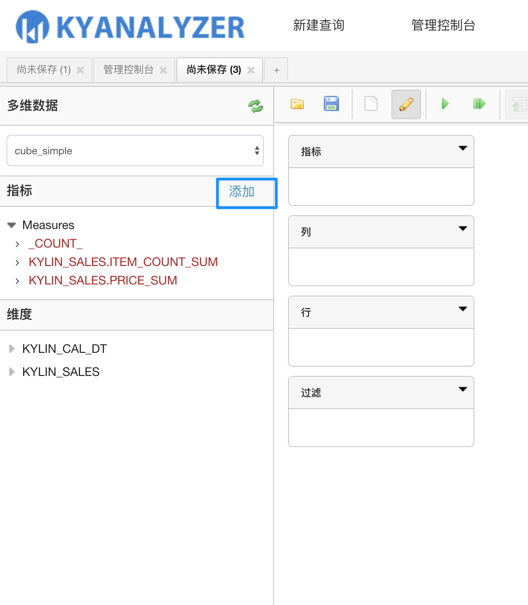
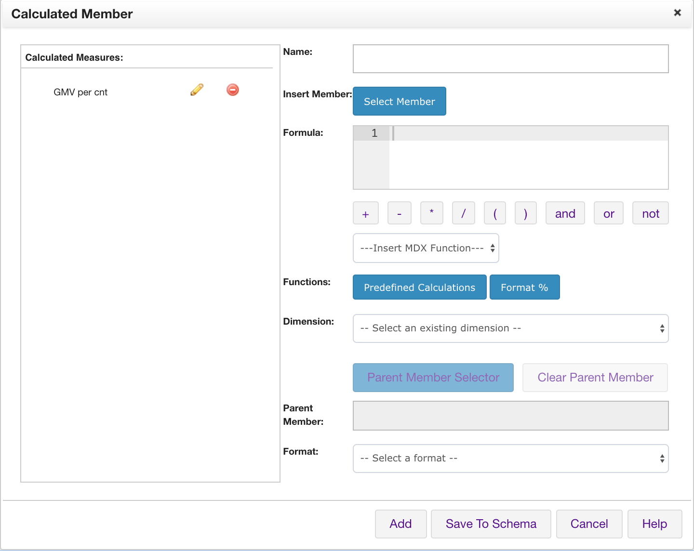
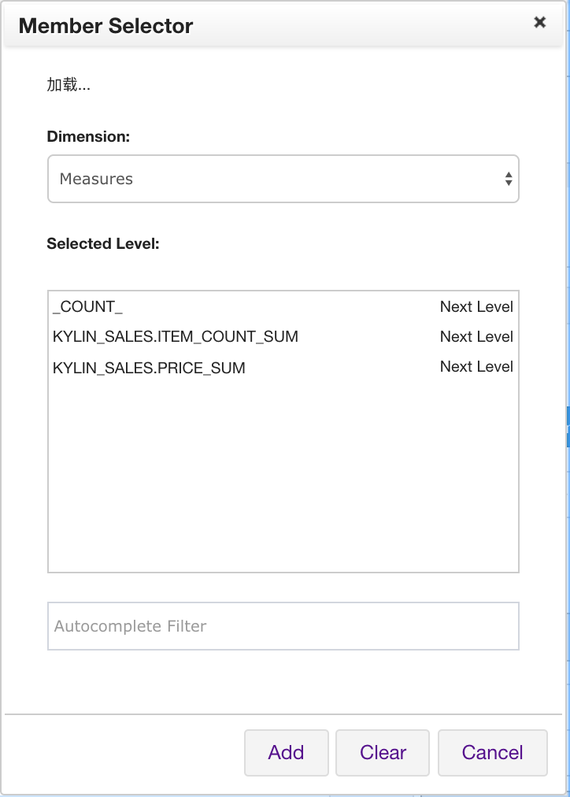
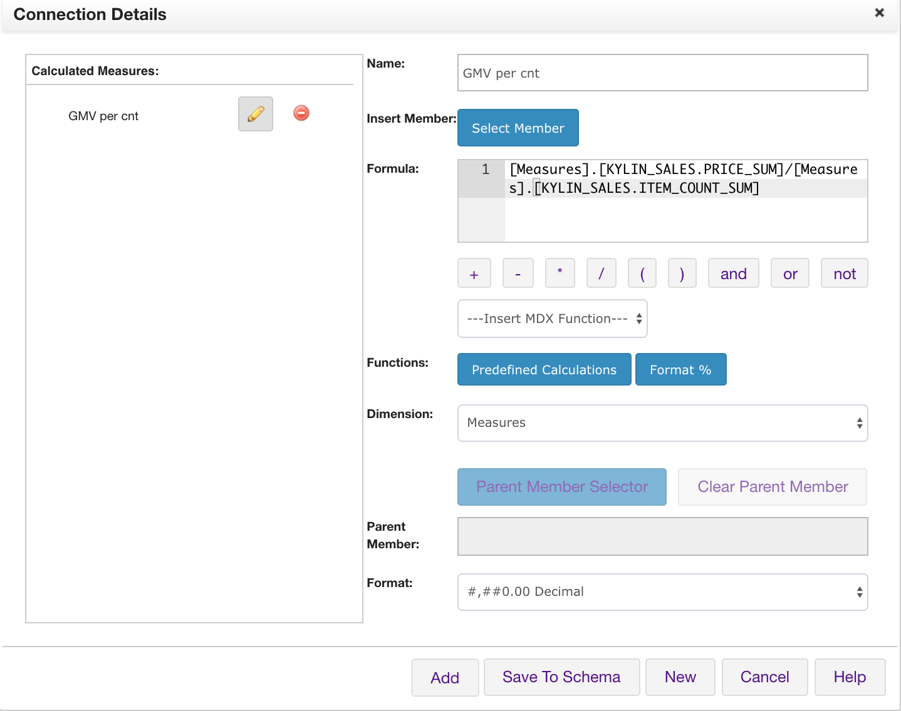
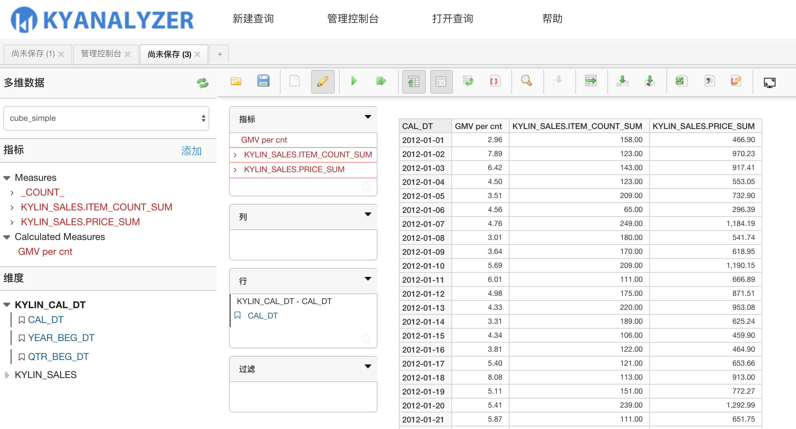

### Calculated Member

Calculated Member 是由一组维度或指标组成的计算，这些计算根据 Cube 数据、运算符、数字和函数来定义。例如，新建一个 Calculated Member 来计算 Cube 中两个物理指标之和。Calculated Member 的定义存储在 KyAanlyzer 中，但它们的值在查询时进行实时计算。

KyAnalyzer 可支持创建 Calculated Member 来使用 MDX。 

下面我们以 KAP 样例 Cube 为例，使用指标 `KYLIN_SALES.ITEM_COUNT_SUM` 和 `KYLIN_SALES.PRICE_SUM` 来创建一个新的 Calculated Member。

1. 点击指标面板右侧的**添加**按钮。



2. 在弹出窗口中开始编辑 Calculated Member。

Calculated Member 创建后，会显示在弹出窗口左侧，供用户今后修改或删除。



3. 点击 **Select Member** 以选择  `KYLIN_SALES.ITEM_COUNT_SUM` 和 `KYLIN_SALES.PRICE_SUM` 。



4. 将表达式定义为 

```sql
[Measures].[GMV_SUM]/[Measures].[TRANS_CNT]
```

在 **Dimension** 下拉菜单中，选择 **Measures**。然后在 **Format** 下拉列表中，选择 Calculated Member 的显示格式。

在完成 Calculated Member 编辑时，需要点击 **Add** 或 **Save to Schema** 来保存此 Calculated Member。点击 **Add** 会把 Calculated Member 仅添加到当前查询中。点击 **Save to Schema** 会将 Calculated Member 保存到当前 Cube 的模型中，便于使用当前 Cube 创建查询的其他用户也可以复用此 Calculated Member。



5. 保存的 Calculated Member 会显示在当前查询的**指标**面板上。现在可以在报表上将它用作常规指标。




