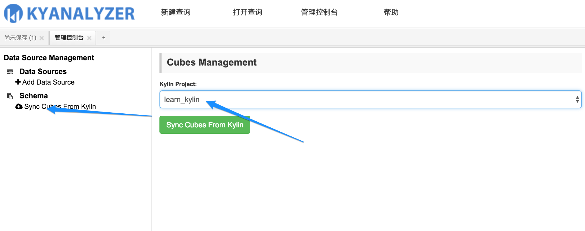
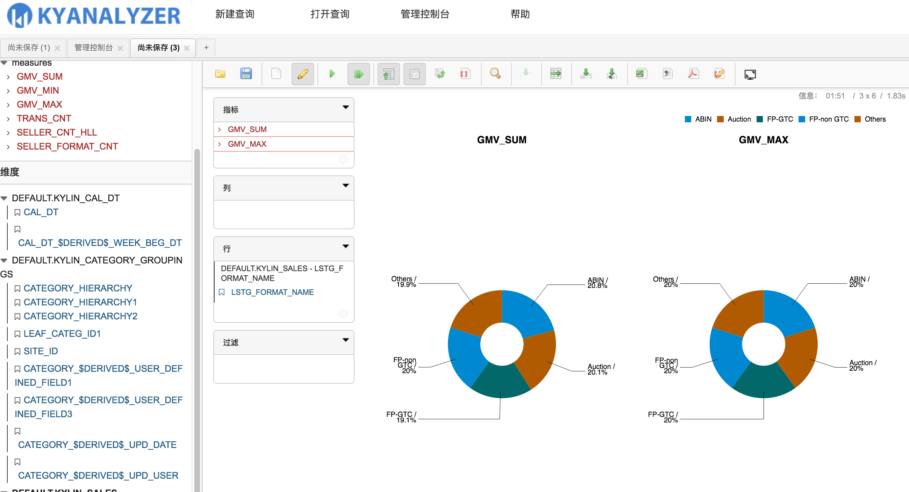
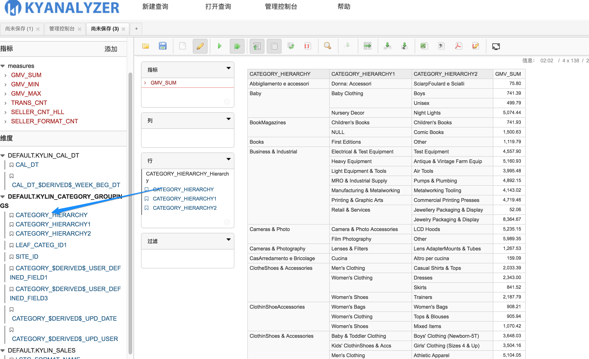
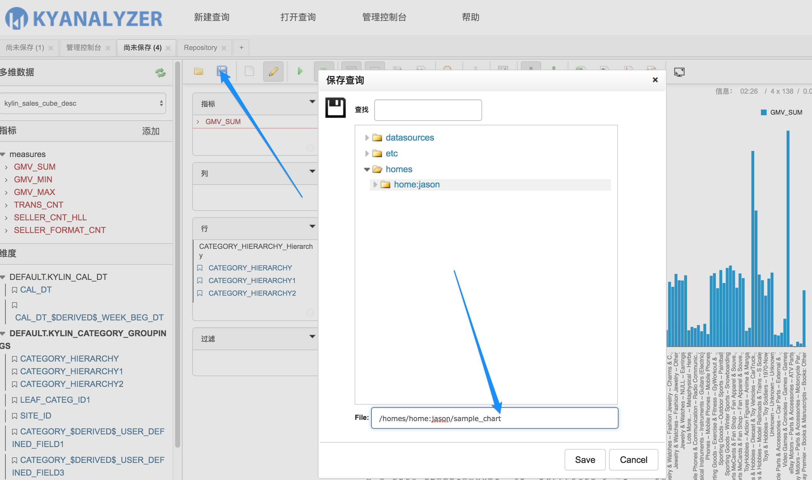
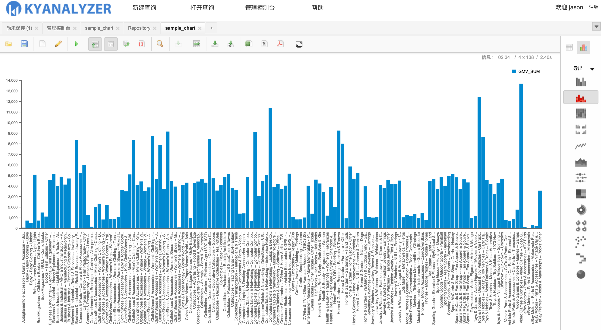

## KyAnalyzer 自助式敏捷BI工具

KyAnalyzer无缝集成KAP（Kylin），让用户以最简单快捷的方式访问KAP的数据。


###使用KyAnalyzer的前提条件
* KAP版本需为2.1或之后版本
* Apache Kylin版本需为1.5.4.1或之后版本
* KyAnalyzer暂不支持*left join*查询，使用者构建Cube模型时需指定join关系为*inner join*


### 安装
在[ KyAccount ]( http://account.kyligence.io/ )申请下载KyAnalyzer的安装包和许可证
解压kyanalyzer安装包，生成目录kyanalyzer-{version}
```tar-zxf KyAnalyzer-{version}.tar.gz```
将license文件kyAnalyzer.lic拷贝至kyanalyzer-{version}/conf下
```mv root kyanalyzer-{version}/conf```

在kyanalyzer-server-{version}/conf目录下有个配置文件kyanalyzer.properties， 需要在该文件中配置好KAP的IP及端口信息，*kap.host*为KAP的IP，默认为localhost，*kap.port*为KAP REST API的端口，默认7070。
同时，关于mondrian的所有配置可以参考conf/mondrian.properties.template 配置到mondrian.properties中。（注：在kap2.2之后，我们将kap.host及kap.port配置移到kyanalyzer.properties中，同时在conf下引入了mondrian.properties）

通过kyanalyzer-{version}目录下的 start-analyzer.sh启动KyAnalyzer
```sh start-analyzer.sh  ```
默认端口为8080,可通过 http://{hostname}:8080 访问页面。如果要停掉应用执行
```sh stop-analyzer.sh```

如果在启动过程中遇到问题页面打不开，可以到tomcat/logs目录下查看具体出错信息。
启动时通过tomcat/logs/catalina.out可以监控到启动时是否有错，如果端口冲突，请修改tomcat/conf/server.xml, 找到如下配置项

```$xslt
<Connector port="8080" protocol="HTTP/1.1"
               connectionTimeout="20000"
               redirectPort="8443" />
```
将`port`改为可用的端口即可。

根目录下文件信息


### 升级
KyAnalyzer的数据信息主要存储在根目录下的repository和data目录下，设要从在KyAnalyzer从在KyAnalyzer-1升级到在KyAnalyzer-2，升级步骤如下：

* 备份KyAnalyzer-1元数据
  + 在KyAnalyzer-1目录下创建备份文件夹，命令：`mkdir backup`
  + 运行命令`cp -r data repository ./backup/`将元数据备份至backup文件夹

* 恢复KyAnalyzer-2为KyAnalyzer-1元数据
  + 新安装KyAnalyzer为KyAnalyzer-2，设KyAnalyzer-2和KyAnalyzer-1目录分别为{KyAnalyzer-2}和{KyAnalyzer-1}
  + 在KyAnalyzer-2目录下，先删除KyAnalyzer-2的自带元数据文件夹，`rm -rf data repository`
  + 在KyAnalyzer-2目录下运行`cp -r ${KyAnalyzer-1}/backup/* ./`

###关于KyAnalyzer,KAP,Mondrian-Kylin 版本功能描述
<table>
    <tr>
    <th>KAP</th>
    <th>KyAnalyzer</th>
    <th>Mondrian-Kylin</th>
    <th>COUNT_DISTINCT</th>
    <th>TOP_N</th>
    <th>正常查询</th>
    <th></th>
    </tr>
    <tr>
        <td>2.0</td>
        <td>&gt;=2.1</td>
        <td>1.0</td>
        <td>❎</td>
        <td>❎</td>
        <td>✅</td>
        <td></td>
    </tr>
    <tr>
        <td>2.0</td>
        <td>&gt;=2.1</td>
        <td>1.1</td>
        <td>✅</td>
        <td>❎</td>
        <td>❎</td>
        <td></td>
    </tr>
    <tr>
        <td>&gt;=2.1</td>
        <td>&gt;=2.1</td>
        <td>1.0</td>
        <td>❎</td>
        <td>❎</td>
        <td>✅</td>
        <td></td>
    </tr> 
    <tr>
        <td>&gt;=2.1</td>
        <td>&gt;=2.1</td>
        <td>1.1</td>
        <td>✅</td>
        <td>✅</td>
        <td>✅</td>
        <td>推荐</td>
    </tr>     
</table>


###关于KyAnalyzer,Apache Kylin,Mondrian-Kylin 版本功能描述
<table>
    <tr>
    <th>Apache Kylin</th>
    <th>KyAnalyzer</th>
    <th>Mondrian-Kylin</th>
    <th>COUNT_DISTINCT</th>
    <th>TOP_N</th>
    <th>正常查询</th>
    <th></th>
    </tr>
    <tr>
        <td>ALL</td>
        <td>&gt;=2.1</td>
        <td>1.0</td>
        <td>❎</td>
        <td>❎</td>
        <td>✅</td>
        <td></td>
    </tr>
    <tr>
        <td>&lt;1.5.4.1</td>
        <td>&gt;=2.1</td>
        <td>1.1</td>
        <td>✅</td>
        <td>❎</td>
        <td>❎</td>
        <td></td>
    </tr>
    <tr>
        <td>1.5.4.1</td>
        <td>&gt;=2.1</td>
        <td>1.1</td>
        <td>✅</td>
        <td>❎</td>
        <td>✅</td>
        <td></td>
    </tr> 
    <tr>
        <td>&gt;1.5.4.1</td>
        <td>&gt;=2.1</td>
        <td>1.1</td>
        <td>✅</td>
        <td>✅</td>
        <td>✅</td>
        <td>推荐</td>
    </tr>         
</table>


### 认证
KyAnalyzer的用户认证是通过KAP认证，所以只需要输入KAP的账号密码即可登录。用户的管理也是通过KAP进行。KAP中的管理员在KyAnalyzer中同样具有Admin角色。


### 管理控制台
该页面仅管理员可见。
为了同步KAP中的Cube，针对每一个Cube，KyAnalyzer中都必须创建一个对应的schema文件，同时配置对应的数据源(data source)。KyAnalyzer将通过这些配置信息组成SQL发送给KAP。KyAnalyzer将这一块自动化掉，用户不需要手动创建schema以及数据源。只需要点击页面左侧的`同步Cube信息`，右侧下拉框会列出KAP中所有的Project。



选中项目后，点击绿色的按钮`同步Cube信息`，KAP中该项目下所有状态为*READY*的Cube信息将会被同步到过来。


KyAnalyzer提供了对schema的在线编辑功能，对mondrian schema用户熟悉的用户可以根据需要修改，正常情况下不需要修改这块。

### 用户的cube查询权限
KyAnalyzer的cube查询权限与该用户在其所连接的kylin/kap的查询权限相同，具体操作方法见[管理权限](../security/acl.cn.md)。

### 新建查询
点击导航栏的`新建查询`按钮，点击`刷新`按钮获取最新的元数据，在`选择多维数据` 下拉框中选中要查询的Cube， 所有相关的维度和指标会列出。报表制作区域有*指标*，*列*，*行*，*过滤* 四个区域，其中*指标* 区域只能拖拽指标，*列*和*行*可以拖拽维度，多个维度可以组合为层级维度等。


KyAnalyzer支持多种展现形式，表格，柱状图，堆积柱状图，百分比堆积柱状图，折线图，面积图，热点图，树状地图，环形图，散点图，瀑布图等，下面列举部分。

#### 柱状图


#### 饼图


#### 数据透视表


#### 对COUNT DISTINCT的支持


#### 对层级维度进行层次化展示



### 数据过滤
对于查询的结果，通过点击行下对应的维度名称，会弹出针对该维度的过滤框，在输入框中输入对应模式缩小筛选范围，然后勾选要过滤的数据，可以通过包含(Include)和排除（Exclude）的方式进行过滤。


### 查询结果保存
查询对应的表格和图标都可以成文件或图片

#### 导出表格


#### 导出图表


### 保存查询结果
我们也可以将当前的查询保存到KyAnalyzer中，下次登录时直接打开即可，不用重复点击。

#### 保存查询


#### 打开查询


#### 执行查询



