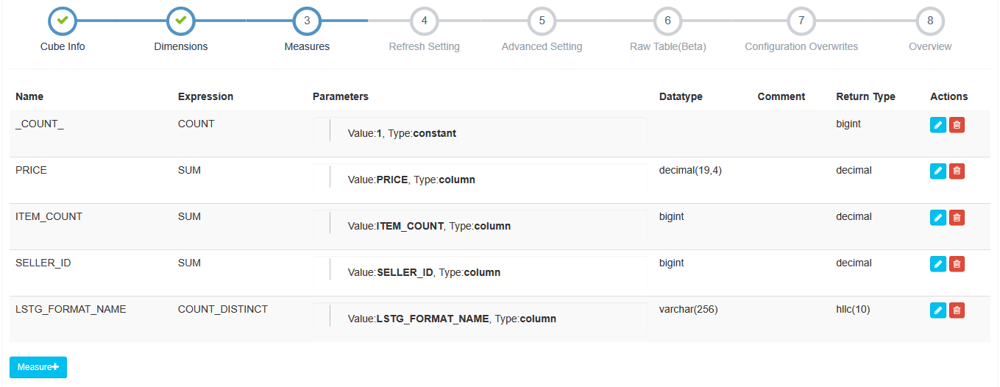
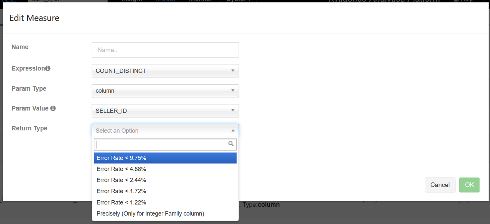

## Count Distinct 近似查询

Count distinct是一个对大多数数据分析师都很常用的函数。KAP 从版本v2.1以来通过 [HyperLogLog](https://hal.inria.fr/hal-00406166/document) 算法支持了Count distinct 查询，并提供了从9.75% 到 1.22%几种不同的误差率以支持不同的查询需求。查询结果具有理论上2^N b的存储体积上限，比如对于最大维度N=16的查询，结果上限为64KB，结果最低误差率为1.22%。 如果你不要求非常精准的查询结果，这种近似的Count Distinct查询就可以在有限的存储资源条件下，完美的得到你需要的结果。

### 查询前提

在使用count distinct 查询之前，你需要确认目标列是否预存了count distinct的预计算结果。在Cube展示界面点击需要查看的Cube的名称，可以通过点击Cube Designer界面的 `度量（measures）` 来查看Cube中所有measure的预计算信息。如果目标列已经被进行过 count distinct的预计算（`表达式(Expression)`为count_distinct 并且 `返回类型(Return Type)`为 hllc）则意味着此列可以直接进行count distinct的近似查询。否则，你需要创建新Cube来存储目标列的count distinct预计算结果。

### Count Distinct 近似查询设置 

首先在创建新Cube的界面，点击左下角`Measures+` 来开始新度量的设置。

然后，从 `Param Value`下拉列表中选择目标列，并从 `Expression`选择COUNT_DISTINCT。之后请谨慎选择 `Return Type` 中的误差率。KAP提供count distinct的近似查询和精确查询。如需要得到某列的近似查询预计算值，你应选择基于HyperLogLog算法的 `Return Type: Error Rate<*%` ，这种近似查询将会在有限的存储资源条件下，返回一个相对准确的查询结果。

请参见 [创建 Cube](molap/create_cube.cn.md) 来继续创建Cube的后续步骤。当你依照  [构建 Cube](molap/build_cube.cn.md)的介绍，完成Cube的构建后，该Cube即准备完毕。

### 示例

请选择默认**数据源** `learn_kylin`，其中表的结构如下：该数据集中有一张事实表（`KYLIN_SALES`）和两张维度表（`KYLIN_CAL_DT` 、`KYLIN_CATEGORY_GROUPINGS`）。请通过**采样数据（Sample Data）**来熟悉事实表的结构 `KYLIN_SALES` 以便之后查询使用。

比如，在 **Insight** 查询界面输入 `select count(distinct LSTG_FORMAT_NAME) as num from kylin_sales where part_dt = DATE '2012-01-02'` ，结果在0.18秒后返回如下：

此结果被验证的同时也表明count distinct 近似查询执行良好。关于count distinct的精确查询信息请参见 [Count Distinct(精确)查询优化](count_distinct_precise.cn.md) 介绍。

### 参考文献

[Use Count Distinct in Apache Kylin](http://kylin.apache.org/blog/2016/08/01/count-distinct-in-kylin/) (Yerui Sun)

