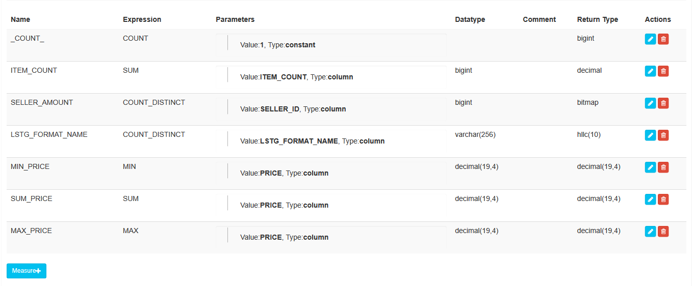
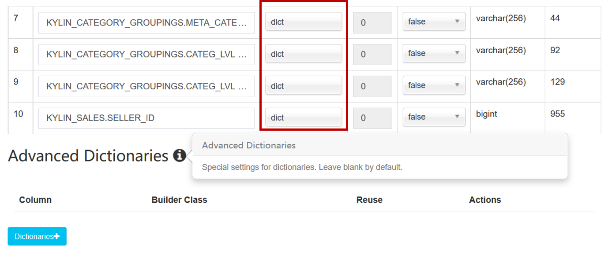

## Count Distinct 精确查询

Count distinct是一个对大多数数据分析师都很常用的函数。KAP 从版本v2.1以来通过位图算法支持了Count distinct 精确查询。对于数据型为tinyint， smallint和int的数据，KAP将把数据对应的值直接打入位图中。对于数据型为long，string和其他的数据，KAP将他们编码成字符串放入字典，然后再将对应的值打入位图。返回的度量结果是已经序列化的位图数据，而不仅是计算的值。这确保了不同的segment中，甚至跨越不同的segment来上卷，结果也是正确的。

### 查询前提

在使用count distinct 查询之前，你需要确认目标列是否预存了count distinct的预计算结果。在Cube展示界面点击需要查看的Cube的名称，可以通过点击Cube Designer界面的 `度量（measures）` 来查看Cube中所有measure的预计算信息。如果目标列已经被进行过 count distinct的预计算（`表达式(Expression)`为count_distinct 并且 `返回类型(Return Type)`为 bitmap）则意味着此列可以直接进行count distinct的精确查询。否则，你需要创建新Cube来存储目标列的count distinct预计算结果。

### Count Distinct 精确查询设置 

首先在创建新Cube的界面，点击左下角`Measures+` 来开始新度量的设置。

然后，从 `Param Value`下拉列表中选择目标列，并从 `Expression`选择COUNT_DISTINCT。之后请谨慎选择 `Return Type` 中的误差选项。KAP提供count distinct的近似查询和精确查询。如需要得到某列的精确查询预计算值，你应选择基于位图（bitmap）算法的 `Return Type:Precisely` 。这种精确查询将会在存储资源充足的情况下返回一个非常精确的结果。例如，如果查询数据为百万级，则返回的一个结果的大小将为百兆左右。

此外还有一些特别的设置步骤在`高级设置(Advanced Setting)`。为了进一步完善count distinct精确查询的设置，也就是说不仅实现在一个segment中的count distinct精确查询，也可以实现跨越多个segment的上卷式查询。因而我们需要在`高级设置(Advanced Setting)` 中添加全局目录（注意：请保持长型，字符串型和其他非整数类型的列的`dict`设置，以此确保他们都可以被编码到全局目录（global dictionary）中。

选择 `Dictionaries+` ，然后选取需要的列作为`Column` 并将如下所示的 global dictionary 设置为 `Builder Class`。请参见 [创建 Cube](create_cube.cn.md) 来继续创建Cube的后续步骤。当你依照  [构建 Cube](../build_cube.cn.md)的介绍，完成Cube的构建后，该Cube即准备完毕。

### 示例

请选择默认**数据源** `learn_kylin`，其中表的结构如下：该数据集中有一张事实表（`KYLIN_SALES`）和两张维度表（`KYLIN_CAL_DT` 、`KYLIN_CATEGORY_GROUPINGS`）。请通过**采样数据（Sample Data）**来熟悉事实表的结构 `KYLIN_SALES` 以便之后查询使用。

比如，在**分析（Insight）** 查询界面输入`select count(distinct seller_id) as seller_num from kylin_sales where part_dt= DATE '2012-01-02'` ，结果在0.18秒后返回如下：

继续输入 `select count(distinct seller_id) as seller_num from kylin_sales where part_dt in ('2012-01-02','2013-01-02')` 结果在0.25秒后返回如下： 

此结果被验证的同时也表明count distinct 精确查询执行良好。关于count distinct的近似查询信息请参见 [近似Distinct Count](count_distinct.cn.md) 介绍。

### 全局目录

KAP在默认状态下会将值编码进Cube segment级的字典。这意味着在不同的segment中的一个值可能被编码成不同的ID，然后导致计数的结果将是不正确的。 在KAP v2.1中，我们引入 “Global Dictionary” 来确保一个值只被编码为一个ID，即使是在不同的segment中。同时，字典的容量也被迅速扩大，现在一个字典已经可以支持最大为20亿数据的值。用户也可以将新上限替换到默认的五百万限制的字典中。

现在全局目录还无法支持对维度的编码，也就是说如果一列被定义为某Cube中既作为维度又作为count distinct 的度量，则该列维度的编码应被设为除了dict以外的其他值。

### 参考文献

[Use Count Distinct in Apache Kylin](http://kylin.apache.org/blog/2016/08/01/count-distinct-in-kylin/) (Yerui Sun)

