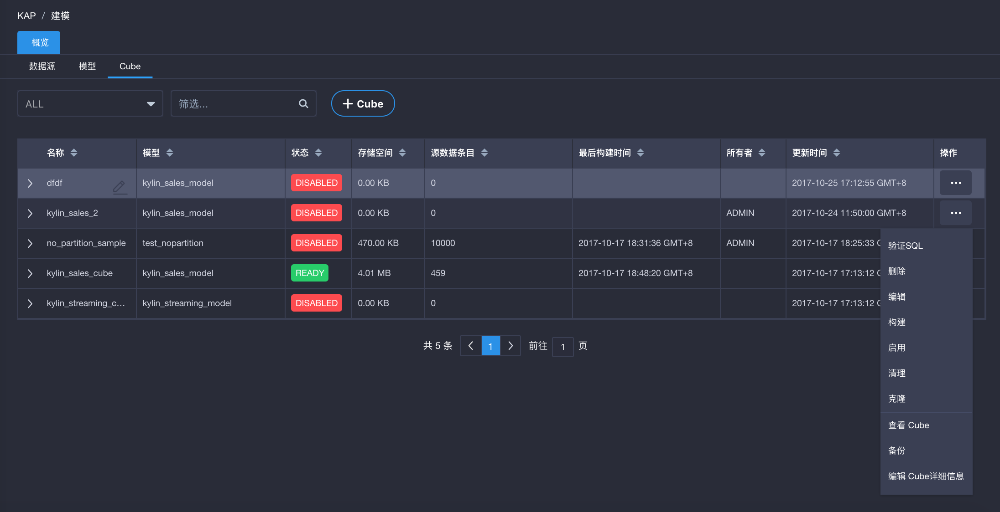
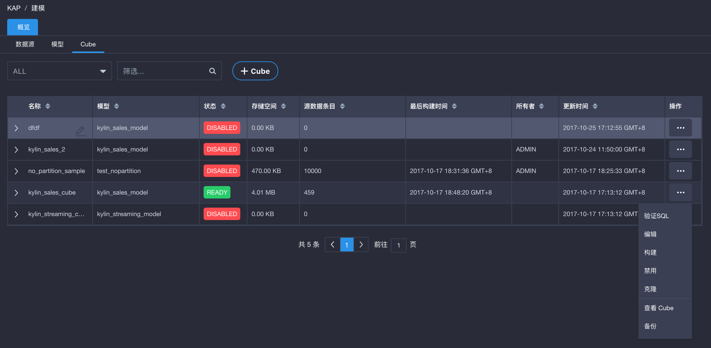
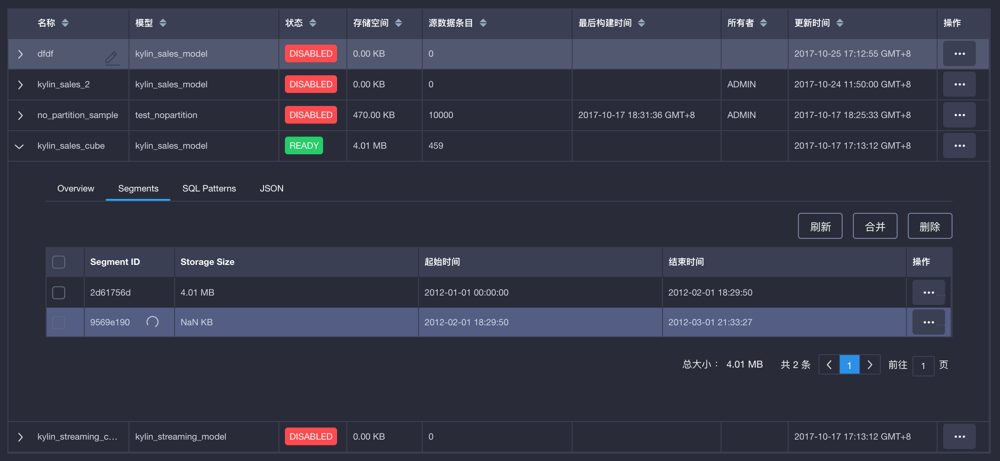
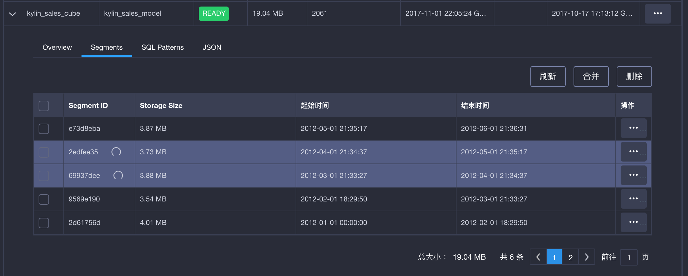

## Cube与Segment管理

### Cube的状态及管理操作

- Draft （草稿）：尚未正式保存的cube，可以继续编辑、删除、查看cube(查看cube描述信息)。

  

  ​

- Disable（禁用）：无法查询的cube，当cube经过构建会自动转成ready状态。

  - 最多可执行的操作有：验证SQL、删除、编辑、构建、启用（将具有segment的cube转化为ready状态）、清理（清空cube下所有segment数据）、克隆（复制cube，但不复制segment数据）、查看cube(查看cube描述信息)、备份（备份cube元数据）、编辑cube详细信息（查看或编辑cube的json信息）。

  

  ​

- Ready（启用）：cube有segment且可以查询，无法直接删除或清理。
  - 最多可执行的操作有：验证SQL、编辑、禁用（将具有ready cube转化为disable状态）、克隆（复制cube，但不复制segment数据）、查看cube(查看cube描述信息)、备份（备份cube元数据）

  

  ​

- Broken：cube元数据被破坏，处于异常状态。

  ​

### Segmeng的状态及管理操作

当cube构建后，会生成segment数据，segment的划分是以分区列（partition column）为依据的。

Segmeng最多可执行的操作：刷新（重新构建该segment）、合并（将多个segment合并为一个，segment不连续也可以合并）、删除。

> 提示：点击正在被构建、刷新、合并的segment ID，可以跳转至监控页面关联的任务。

- 构建cube后，查看cube下的segment，正在构建的segment如下图所示。

- 刷新segment等同于重新构建该segment，因此正在刷新的segment也如下图所示。

  

  ​

- 合并segment时，老segment会被重新构建，具体如下图所示。

  

