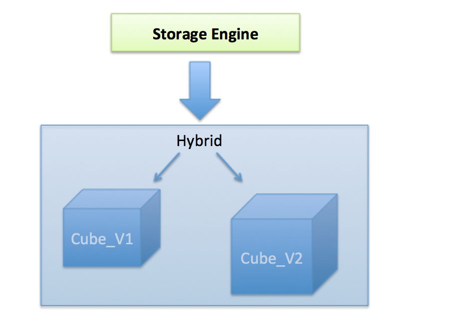

## Hybrid Cube

Hybrid Cube是Apache Kylin 1.0引入的概念，本文将介绍Hybrid Cube的概念和操作方法。

### 需求场景

对于SQL查询，Kylin会选择一个查询引擎的实现进行响应，最常见的是Cube，只且只有一个Cube会被选中进行查询。查询的能力受限于Cube的模型设计。

假设用户已经创建了一个Cube，名为Cube_V1，经过几个月的业务发展，用户需要添加新的维度和指标以满足新的业务需求，因此又创建了Cube_V2。

基于以下原因，用户希望继续保留Cube_V1，并希望在Cube_V1的截止日期之后构建Cube _V2，同时Cube_V1和Cube_V2将可以跨时间区间一起响应用户的查询：

- Cube_V1对应的Hive原始数据已经被删除，因此不可能重新构建Cube_V2的历史数据。
- 由于资源限制，或者数据量太大，重新构建Cube耗时太长。
- 新的维度和度量仅在某个日期后才生效。
- 业务上允许当查询旧数据时，新的维度和度量可以是空值。

对于Cube_V1和Cube_V2共有的维度和度量，用户期待两个Cube可以共同参与查询，为用户提供完整的查询结果集。在这样的背景下，Kylin研发了Hybrid Cube概念，用于服务这些场景。

### Hybrid Cube概念

Hybrid Cube是一种新的查询引擎实现，它可以包含多个Cube，如下图所示：



Hybrid Cube并不是真的存储数据，而是逻辑上的Cube，类似于数据库中View的概念。Hybrid Cube承担代理的角色，它将查询语句分别发给所有子Cube，如果某个子Cube有能力响应查询，即它的维度和度量与查询匹配，则响应查询，并返回结果给Hybrid Cube，否则忽略跳过。Hybrid Cube将查询结果汇总之后返回给用户。

如果Hybrid Cube所代理的真实Cube可以响应某个查询，则该Hybrid Cube会被查询引擎选中，因此Hybrid Cube会比普通Cube有更高的优先级被选中。

Hybrid Cube并不会检查子Cube之间的时间区间是否重叠，需要用户确保Cube之间没有时间范围的重叠，否则会引起查询结果的不准确。

为避免Hybrid Cube未预期的行为，目前所有的子Cube都被限定在同一个Project，同一个Model。并且Hybrid Cube只能代理真实的Cube，不支持Hybrid Cube代理另一个Hybrid Cube。

### HybridCubeCLI工具

KAP提供HybridCubeCLI工具，方便用户操作Hybrid Cube，它包含

- 将多个Cube添加到新的Hybrid Cube


- 检查Cube之间没有时间的重叠


- 将某个Cube添加到已有的Hybrid Cube


常见操作：

action表示操作的类型，包括create／update／delete

name表示HybridCube的名字，唯一标识一个HybridCube

project和model用于定位HybridCube所在的Project和Model，HybridCube限定了所有的Cube和Hybrid Cube都属于同一个Project和Model。

cubes表示用户HybridCube的子Cube，逗号分隔，所有Cube均隶属同一个Project和Model

```shell
#创建HybridCube
bin/kylin.sh org.apache.kylin.tool.HybridCubeCLI -action create -name hybrid_name -project project_name -model model_name -cubes cube1,cube2

#更新HybridCube
bin/kylin.sh org.apache.kylin.tool.HybridCubeCLI -action update -name hybrid_name -project project_name -model model_name -cubes cube1,cube2,cube3

#删除HybridCube
bin/kylin.sh org.apache.kylin.tool.HybridCubeCLI -action delete -name hybrid_name -project project_name -model model_name
```