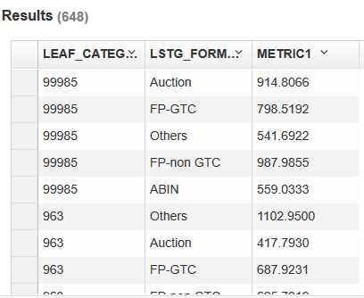

### SQL 分组函数

从KAP v2.1开始，我们提供分组函数(grouping sets function)来支持在一条SQL查询中完成根据不同索引建的数据聚合。本节将着重介绍如何应用这组函数。


## 分组函数简介

KAP中已经支持的分组函数如下：

| 执行语法                                     | 返回描述                        |
| ---------------------------------------- | --------------------------- |
| GROUPING(expression)                     | 如果表达式中的当前维度上卷（总计）返回1，否则返回0。 |
| GROUP_ID()                               | 根据分组键的组合返回一个对应整数。           |
| GROUPING_ID(expression [, expression ] * ) | 返回一个给定分组表达式的位向量。            |


#### 示例

我们将使用KAP中的默认数据集作为本示例的数据源，逐步向您介绍如何在KAP中使用分组函数。

#### 数据集

请选择默认**数据源** `learn_kylin`，其中表的结构如下：该数据集中有一张事实表（`KYLIN_SALES`）和两张维度表（`KYLIN_CAL_DT` 、`KYLIN_CATEGORY_GROUPINGS`）。请通过**数据样例**来熟悉事实表的结构 `KYLIN_SALES` 以便之后查询使用。


#### Group 查询语句

一般销售分析的场景中，为了得到不同品牌（或者不同产品）的销售额，我们可以输入以下查询语句： `select LEAF_CATEG_ID, LSTG_FORMAT_NAME, sum(PRICE) as metric1 from kylin_sales group by LEAF_CATEG_ID, LSTG_FORMAT_NAME`。查询结果在0.26秒后返回如下：




#### Grouping sets 查询语句

如果你希望得到将`lstg_format_name`(dim2)维度上卷后的结果，可以通过改写上面的查询语句得到：

```
select LEAF_CATEG_ID,
case grouping(LSTG_FORMAT_NAME) when 1 then 'ALL' else LSTG_FORMAT_NAME end,
sum(PRICE) as metric1 from kylin_sales
group by grouping sets((LEAF_CATEG_ID, LSTG_FORMAT_NAME), (LEAF_CATEG_ID))
order by LEAF_CATEG_ID
```

 返回结果如下所示：


