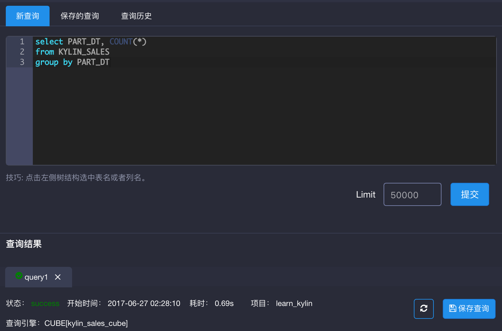
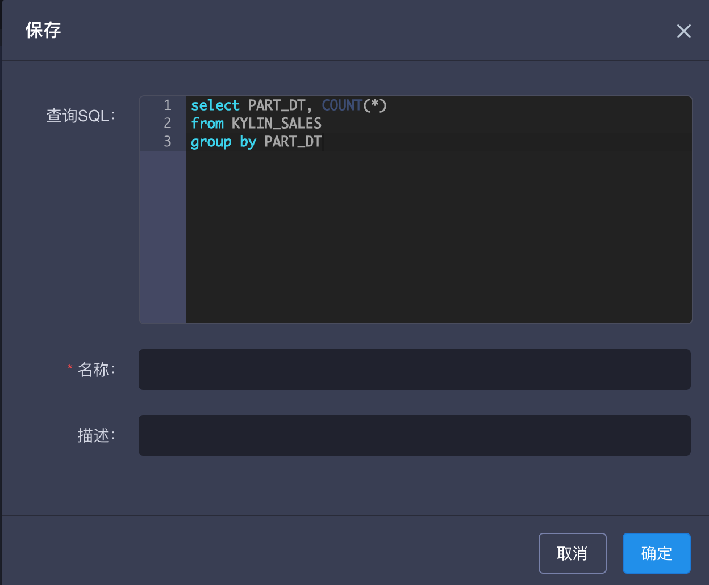
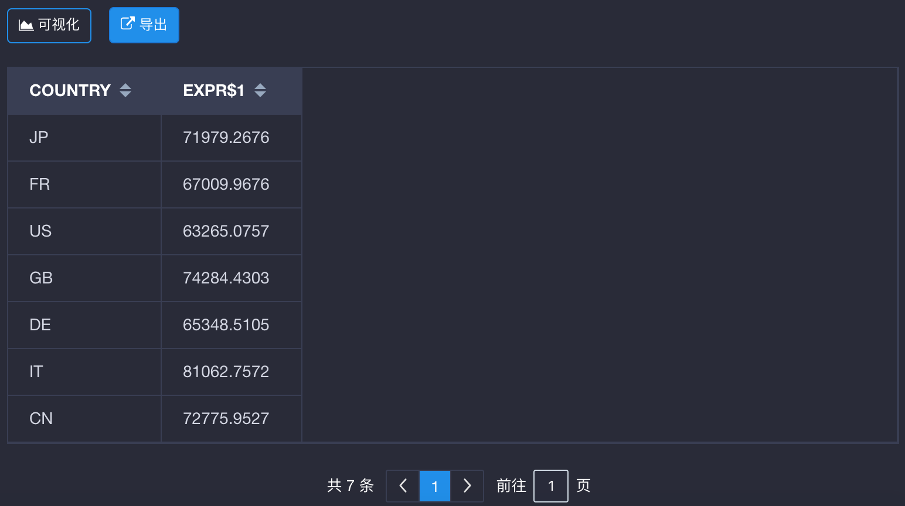
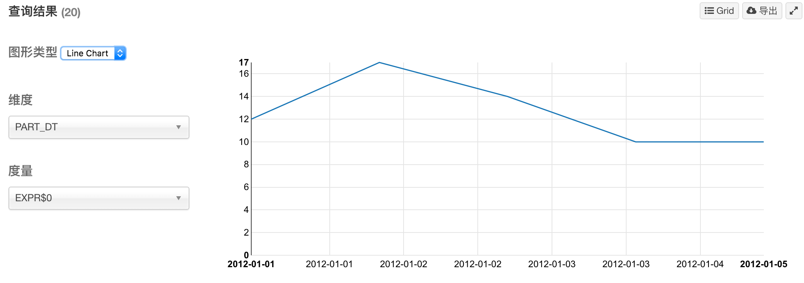
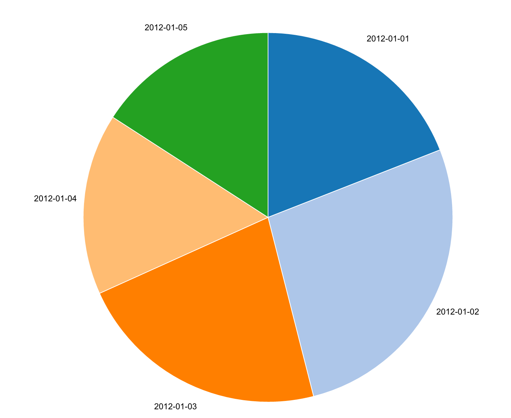

## Insight查询界面

> **支持的浏览器**
>
> Windows: Google Chrome, FireFox
>
> Mac: Google Chrome, FireFox, Safari

### Web查询页概览
KAP的分析页面即为查询页面。点击“分析”标签后，左边将列出所有可以查询的表，与这些表相对应的Cube已经构建完成；右边给出了输入框，在此输入SQL语句，将在下方显示结果。下面详述不同标识对应的解释。

* **F(FACT)** - 事实表
* **L(LOOKUP)** - 维度表

### SQL查询
> **查询限制**
>
> 1. 仅支持SELECT查询
>
> 2. 若未开启即席查询，无法根据cube中的数据满足的查询，将不会进行重定向

* 提供一个输入框以输入SQL语句，点击提交按钮即可进行查询。在右下角提交按钮旁有一个limit输入框，如果SQL语句中没有limit字段，此处会拼接上limit 50000的默认值；如果SQL语句中有limit字段则以SQL语句为准。假如用户想去掉limit限制，请将右下角的limit输入框中的内容改为0。
* 查询结果成功返回后，会在状态下方的查询引擎条目里，显示该查询所命中的Cube。

### 保存查询
与用户账号关联，用户将能够从不同的浏览器甚至机器上获取已保存的查询。在结果区域点击保存图标，将会弹出名称和描述来保存当前查询。

### 查询历史
仅保存当前用户在当前浏览器中的查询历史，这将需要启用cookie，并且如果用户清理浏览器缓存，将会丢失已缓存的查询历史。点击“Query History”标签中，用户可以直接重新提交其中的任何一条并再次运行。

### 即席查询

KAP从2.4版本开始支持即席查询。当用户需要执行定制的Cube无法满足的查询时，可以使用即席查询，将该查询重定向至Spark SQL或者Hive，从而在查询的执行时间与灵活程度之间做一个权衡折中，获取更理想的使用体验。

即席查询功能默认未开启。如果用户需要开启即席查询，需要在`kylin.properties`文件中删去`kylin.query.pushdown.runner-class-name=io.kyligence.kap.storage.parquet.adhoc.PushDownRunnerSparkImpl`这一配置项前的注释符号使其生效。即席查询开启后，当Cube无法返回所需的查询结果时，默认将被重定向至Spark SQL。用户也可以手动配置，选择Hive作为重定向的对象。更多配置请参考[Kylin配置参数](../config/basic_settings.cn.md)。

开启即席查询后，所有同步的数据表将对用户可见，而无需构建相应的Cube。用户在提交查询时，若即席查询发挥作用，则状态下方的查询引擎条目里，会显示Pushdown。

### 数据展现的方式

##### 表格

默认情况下，KAP会以表格形式展示数据，可以对数据进行升序或降序排列，也可以对字段进行隐藏。也可以点击”导出“按钮以导出csv文件。

点击”可视化“按钮，可以对数据进行可视化展示。KAP默认支持三种图形展示，分别是线形图、柱状图、饼图。

#### 图表展示

- 线形图展示

- 柱状图展示 

- 饼图展示

