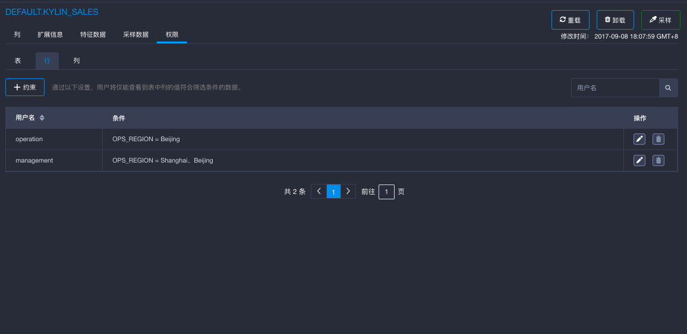
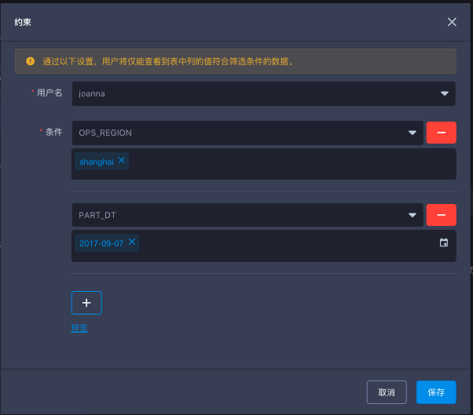
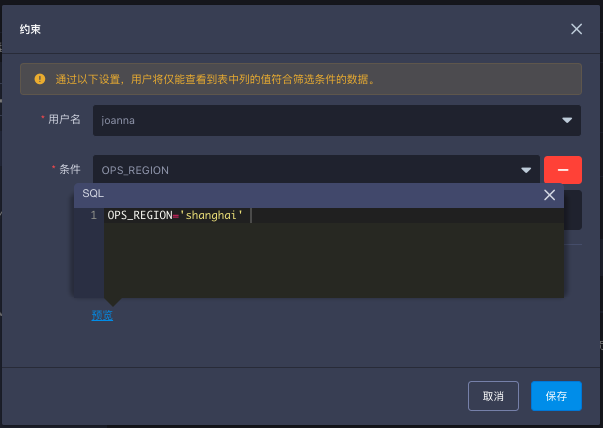
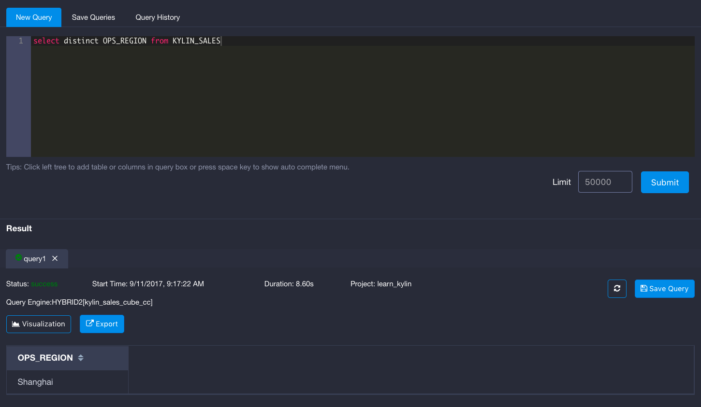

## 行级访问权限

**行级访问权限**过滤了用户在表上可访问的行。行级访问权限通常都被用在限制非常敏感的数据。比如在一个公司中，销售大区经理仅能查看到属于他／她大区的销售数据，但看不到其他大区的销售数据。你希望给东北大区的销售经理设置行级权限这样他仅能看到地区=‘东北’的销售数据。

不论用户的查询使用Cube、明细表索引还是查询下压查询都会受到行级权限的过滤。如果用户的查询中没有使用到行级权限受限的列那么行级权限则不会作用到查询上。

当表初次被导入KAP中或者项目从低版本升级到有行级权限功能的版本时，默认情况下所有用户在表上都**没有**设置行级权限。

行级权限需要以项目为单位进行设置。也就是说如果同一个表在不同项目中都导入了，两个项目下的行级权限需要分别设置。

### 管理行级项目权限

#### 添加约束

按照以下步骤对列级访问权限约束进行添加：

1. 点击左侧导航栏中的`建模`。
2. 点击`数据源`，选择一个已导入的表。
3. 在这个表上，点击`权限`，然后选择`行`。
4. 点击`+约束`以约束行级权限。
5. 在弹窗中选择用户。
6. 选择列，并输入欲限定的值。点击回车确认每个输入的值。你可以输入多个值进行过滤。
7. (可选) 点击`+`号添加对另一个列的过滤。
8. 保存。

行级权限会转换成查询中的Where语句附加在用户的查询后。如果对同一个列过滤多个值，每个值之间的逻辑运算符为`或`。 当为同一个用户设置多列的过滤的值时，不同列之间的逻辑运算符为`与`。

在设置行级权限的弹窗中点击`预览`你可以预览行级权限将会生成的Where语句。

#### 修改约束

按照以下步骤对行级访问权限约束进行修改：

1. 点击左侧导航栏中的`建模`。
2. 点击`数据源`，选择一个已导入的表。
3. 在这个表上，点击`权限`，然后选择`行`。
4. 在`操作`中，点击`修改`按钮。
5. 在弹窗中，对行级权限进行修改。
6. 保存。

#### 删除约束

按照以下步骤对行级访问权限约束进行修改：

1. 点击左侧导航栏中的`建模`。
2. 点击`数据源`，选择一个已导入的表。
3. 在这个表上，点击`权限`，然后选择`行`。
4. 在`操作`中，点击`删除`按钮。

### 验证行级访问权限

在本例中用户`joanna` 是一个有项目 `learn_kylin `访问权限的用户，并且被限制了对列 `OPS_REGION`的访问仅为‘Shanghai’。

登录用户`joanna`来到查询页面使用列 `OPS_REGION`进行查询以验证行级访问权限约束是否生效了。

如截图所示用户`joanna`仅能看到`OPS_REGION`值为‘Shanghai’的行。

